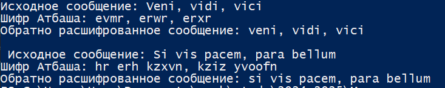

---
## Front matter
lang: ru-RU
title: Лабораторная работа №1
subtitle: Математические основы защиты информации и информационной безопасности
author:
  - Николаев Дмитрий Иванович, НПМмд-02-24
institute:
  - Российский университет дружбы народов имени Патриса Лумумбы, Москва, Россия
date: 6 сентября 2024


## i18n babel
babel-lang: russian
babel-otherlangs: english

## Formatting pdf
toc: false
toc-title: Содержание
slide_level: 2
aspectratio: 169
section-titles: true
theme: metropolis
header-includes:
 - \metroset{progressbar=frametitle,sectionpage=progressbar,numbering=fraction}
 - '\makeatletter'
 - '\beamer@ignorenonframefalse'
 - '\makeatother'
---

# Прагматика выполнения

- Освоение шифров простой замены --- шифры Цезаря и Атбаша;
- Программная реализация данных шифров на языке Julia.
 
# Цель

Изучить шифры простой замены, а именно шифр Цезаря и шифр Атбаша. Научиться программной реализации шифра Цезаря с произвольным ключом и шифра Атбаша на языке программирования Julia.

# Задачи

1. Изучить шифры простой замены --- шифры Цезаря и Атбаша.
2. Реализация шифра Цезаря с произвольным ключом на Julia.
3. Реализация шифра Атбаша с произвольным ключом на Julia.

# Выполнение работы

## Шифр Цезаря 1

```Julia
alphabet = 'a':'z'  # Алфавит
function Caesar_Cipher(Input_Message::String, key::Int)::String
    # Зашифрованное сообщение
    Cipher = String[]
    for char in lowercase(Input_Message)
        if char in alphabet
            position = findfirst(x -> x == char, alphabet)
            # осуществляем сдвиг согласно ключу key
            new_position = mod1(position + key, length(alphabet))
            push!(Cipher, string(alphabet[new_position]))
        else
            # Символ не из алфавита остаётся неизменным
            push!(Cipher, string(char)) 
        end
    end
    return join(Cipher)
end
```

## Шифр Цезаря 2

```Julia
    end
    return join(Cipher)
end
Test_Message = "Veni, vidi, vici"
Test_Key = 3
println("Исходное сообщение: ", Test_Message)
println("Шифр Цезаря с ключом $(Test_Key): ", 
        Caesar_Cipher(Test_Message, Test_Key))
println("Обратно расшифрованное сообщение: ", 
Caesar_Cipher(Caesar_Cipher(Test_Message, Test_Key), length(alphabet) - Test_Key))
Message_1 = "Si vis pacem, para bellum"
Key_1 = 6
println("\n Исходное сообщение: ", Message_1)
println("Шифр Цезаря с ключом $(Key_1): ", 
        Caesar_Cipher(Message_1, Key_1))
println("Обратно расшифрованное сообщение: ", 
Caesar_Cipher(Caesar_Cipher(Message_1, Key_1), length(alphabet) - Key_1))
```

## Шифр Цезаря 3

{#fig:001 width=80%}

## Шифр Атбаша 1

```Julia
function Atbash_Cipher(Input_Message::String)::String
    # Зашифрованное сообщение
    Cipher = String[]
    Reversed_alphabet = reverse(alphabet)
    for char in lowercase(Input_Message)
        if char in alphabet
            position = findfirst(x -> x == char, alphabet)
            # осуществляем сдвиг на весь алфавит
            push!(Cipher, string(Reversed_alphabet[position]))
        else
            # Символ не из алфавита остаётся неизменным
            push!(Cipher, string(char))
        end
    end
    return join(Cipher)
end
```

## Шифр Атбаша 2

```Julia
    return join(Cipher)
end
println("\n\nИсходное сообщение: ", Test_Message)
println("Шифр Атбаша: ", Atbash_Cipher(Test_Message))
println("Обратно расшифрованное сообщение: ", 
        Atbash_Cipher(Atbash_Cipher(Test_Message)))
Message_1 = "Si vis pacem, para bellum"
Key_1 = 6
println("\n Исходное сообщение: ", Message_1)
println("Шифр Атбаша: ", Atbash_Cipher(Message_1))
println("Обратно расшифрованное сообщение: ", 
        Atbash_Cipher(Atbash_Cipher(Message_1)))
```

## Шифр Атбаша 3

{#fig:002 width=80%}

# Результаты

В ходе работы я изучил шифры простой замены, а именно шифры Цезаря и Атбаша, а также написал программную реализацию шифра Цезаря с произвольным ключом и шифра Атбаша на языке программирования Julia.
