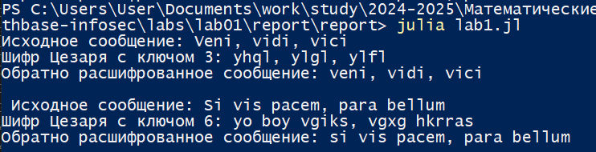
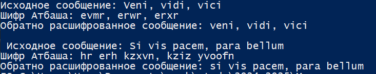

---
## Front matter
title: "Лабораторная работа №1"
subtitle: "Математические основы защиты информации и информационной безопасности"
author: "Николаев Дмитрий Иванович, НПМмд-02-24"

## Generic otions
lang: ru-RU
toc-title: "Содержание"

## Bibliography
bibliography: bib/cite.bib
csl: pandoc/csl/gost-r-7-0-5-2008-numeric.csl

## Pdf output format
toc: true # Table of contents
toc-depth: 2
lof: true # List of figures
lot: true # List of tables
fontsize: 12pt
linestretch: 1.5
papersize: a4
documentclass: scrreprt
## I18n polyglossia
polyglossia-lang:
  name: russian
  options:
	- spelling=modern
	- babelshorthands=true
polyglossia-otherlangs:
  name: english
## I18n babel
babel-lang: russian
babel-otherlangs: english
## Fonts
mainfont: PT Serif
romanfont: PT Serif
sansfont: PT Sans
monofont: PT Mono
mainfontoptions: Ligatures=TeX
romanfontoptions: Ligatures=TeX
sansfontoptions: Ligatures=TeX,Scale=MatchLowercase
monofontoptions: Scale=MatchLowercase,Scale=0.9
## Biblatex
biblatex: true
biblio-style: "gost-numeric"
biblatexoptions:
  - parentracker=true
  - backend=biber
  - hyperref=auto
  - language=auto
  - autolang=other*
  - citestyle=gost-numeric
## Pandoc-crossref LaTeX customization
figureTitle: "Рис."
tableTitle: "Таблица"
listingTitle: "Листинг"
lofTitle: "Список иллюстраций"
lotTitle: "Список таблиц"
lolTitle: "Листинги"
## Misc options
indent: true
header-includes:
  - \usepackage{indentfirst}
  - \usepackage{float} # keep figures where there are in the text
  - \floatplacement{figure}{H} # keep figures where there are in the text
---

# Цель работы

Изучить шифры простой замены, а именно шифр Цезаря и шифр Атбаша. Научиться программной реализации шифра Цезаря с произвольным ключом и шифра Атбаша на языке программирования Julia.

# Теоретическое введение

Шифры простой замены представляют собой одни из первых и самых элементарных методов шифрования, применяемых для защиты данных. Эти шифры функционируют на основе замены символов оригинального текста (известного как открытый текст) другими символами, что делает информацию недоступной для несанкционированных пользователей. Классическими примерами такого рода шифрования являются шифр Цезаря и шифр Атбаша.

Шифр Цезаря, названный в честь Юлия Цезаря, который использовал его для защиты военных сообщений, --- это метод, при котором каждый символ открытого текста сдвигается на определённое количество позиций в алфавите. Например, при смещении на три буквы 'A' превращается в 'D', 'B' --- в 'E' и так далее. Этот способ прост в применении, но подвержен частотному анализу, так как сохраняет особенности языка.

Шифр Атбаша является более элементарным вариантом шифра замены, в котором буквы меняются на их "отражения" в алфавите. Например, 'A' становится 'Z', 'B' --- 'Y' и так далее.

# Ход работы

Следуем указаниям из [@lab1]. Реализуем для начала функцию шифра Цезаря с произвольным ключом.

```Julia
alphabet = 'a':'z'  # Алфавит
function Caesar_Cipher(Input_Message::String, key::Int)::String
    # Зашифрованное сообщение
    Cipher = String[]
    for char in lowercase(Input_Message)
        if char in alphabet
            position = findfirst(x -> x == char, alphabet)
            # осуществляем сдвиг согласно ключу key
            new_position = mod1(position + key, length(alphabet))
            push!(Cipher, string(alphabet[new_position]))
        else
            # Символ не из алфавита остаётся неизменным
            push!(Cipher, string(char))
        end
    end
    return join(Cipher)
end
```

Дальше проверяем его работу на двух сообщениях ([@fig:001]):

```Julia
Test_Message = "Veni, vidi, vici"
Test_Key = 3
println("Исходное сообщение: ", Test_Message)
println("Шифр Цезаря с ключом $(Test_Key): ", 
        Caesar_Cipher(Test_Message, Test_Key))
println("Обратно расшифрованное сообщение: ", 
Caesar_Cipher(Caesar_Cipher(Test_Message, Test_Key), length(alphabet) - Test_Key))
Message_1 = "Si vis pacem, para bellum"
Key_1 = 6
println("\n Исходное сообщение: ", Message_1)
println("Шифр Цезаря с ключом $(Key_1): ", 
        Caesar_Cipher(Message_1, Key_1))
println("Обратно расшифрованное сообщение: ", 
Caesar_Cipher(Caesar_Cipher(Message_1, Key_1), length(alphabet) - Key_1))
```

{#fig:001 width=80%}

Реализуем далее функцию шифра Атбаша.

```Julia
function Atbash_Cipher(Input_Message::String)::String
    # Зашифрованное сообщение
    Cipher = String[]
    Reversed_alphabet = reverse(alphabet)
    for char in lowercase(Input_Message)
        if char in alphabet
            position = findfirst(x -> x == char, alphabet)
            # осуществляем сдвиг на весь алфавит
            push!(Cipher, string(Reversed_alphabet[position]))
        else
            # Символ не из алфавита остаётся неизменным
            push!(Cipher, string(char))
        end
    end
    return join(Cipher)
end
```

Дальше проверяем его работу на тех же двух сообщениях ([@fig:002]):

```Julia
println("\n\nИсходное сообщение: ", Test_Message)
println("Шифр Атбаша: ", Atbash_Cipher(Test_Message))
println("Обратно расшифрованное сообщение: ", 
        Atbash_Cipher(Atbash_Cipher(Test_Message)))
Message_1 = "Si vis pacem, para bellum"
Key_1 = 6
println("\n Исходное сообщение: ", Message_1)
println("Шифр Атбаша: ", Atbash_Cipher(Message_1))
println("Обратно расшифрованное сообщение: ", 
        Atbash_Cipher(Atbash_Cipher(Message_1)))
```

{#fig:002 width=80%}

# Выводы

В ходе выполнения лабораторной работы я изучил шифры простой замены, а именно шифры Цезаря и Атбаша, а также написал программную реализацию шифра Цезаря с произвольным ключом и шифра Атбаша на языке программирования Julia.

# Список литературы{.unnumbered}

::: {#refs}
:::
