---
## Front matter
lang: ru-RU
title: Лабораторная работа №2
subtitle: Математические основы защиты информации и информационной безопасности
author:
  - Николаев Дмитрий Иванович, НПМмд-02-24
institute:
  - Российский университет дружбы народов имени Патриса Лумумбы, Москва, Россия
date: 28 сентября 2024

## i18n babel
babel-lang: russian
babel-otherlangs: english

## Formatting pdf
toc: false
toc-title: Содержание
slide_level: 2
aspectratio: 169
section-titles: true
theme: metropolis
header-includes:
 - \metroset{progressbar=frametitle,sectionpage=progressbar,numbering=fraction}
 - '\makeatletter'
 - '\beamer@ignorenonframefalse'
 - '\makeatother'
---

# Прагматика выполнения

- Освоение алгоритмов шифров перестановки --- маршрутного шифрования, шифрования с помощью решёток и таблицы Вижинёра

# Цели

Изучить работу шифров перестановки --- маршрутного шифрования, шифрования с помощью решёток и таблицы Вижинёра, а также реализовать их программно.

# Задачи

1. Освоить и реализовать алгоритм маршрутного шифрования (и расшифрования) на языке Julia;
2. Освоить и реализовать алгоритм шифрования с помощью решёток (и расшифрования) на языке Julia;
3. Освоить и реализовать алгоритм шифрования с помощью таблицы Вижинёра (и расшифрования) на языке Julia.

# Выполнение работы

## Маршрутное шифрование (1/4)

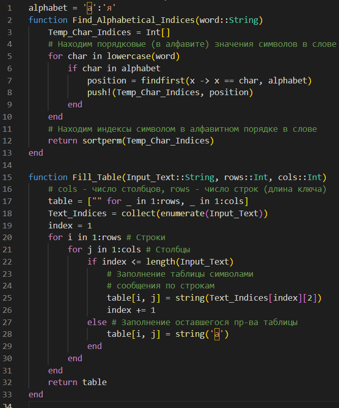{#fig:001 width=80%}

## Маршрутное шифрование (2/4)

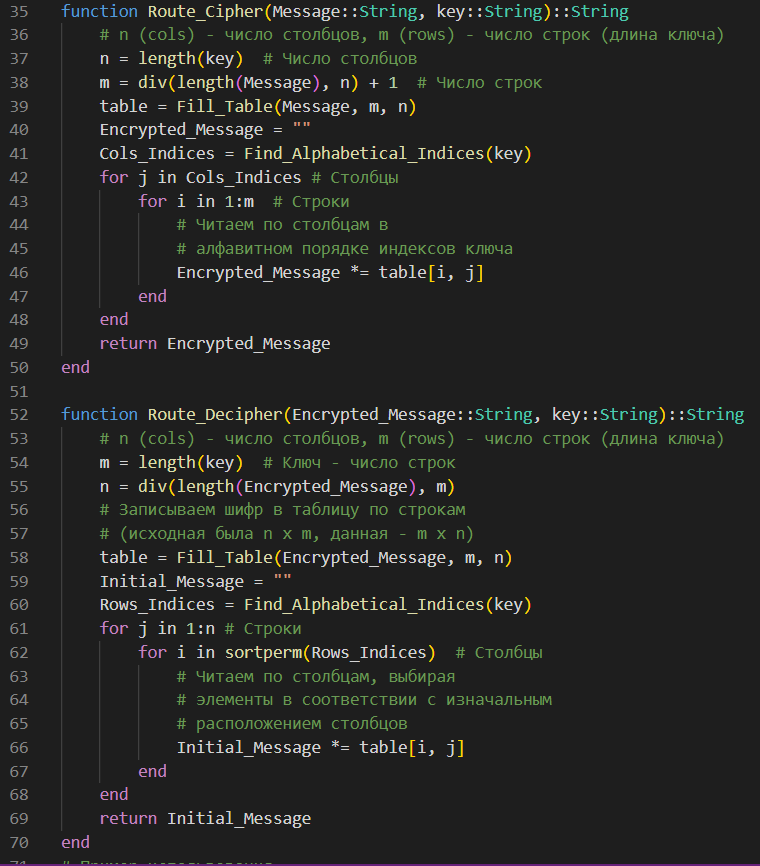{#fig:002 width=80%}

## Маршрутное шифрование (3/4)

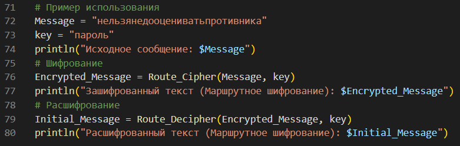{#fig:003 width=80%}

## Маршрутное шифрование (4/4)

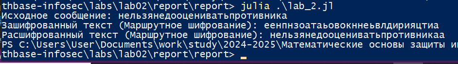{#fig:004 width=80%}

## Шифрование с помощью решеток (1/5)

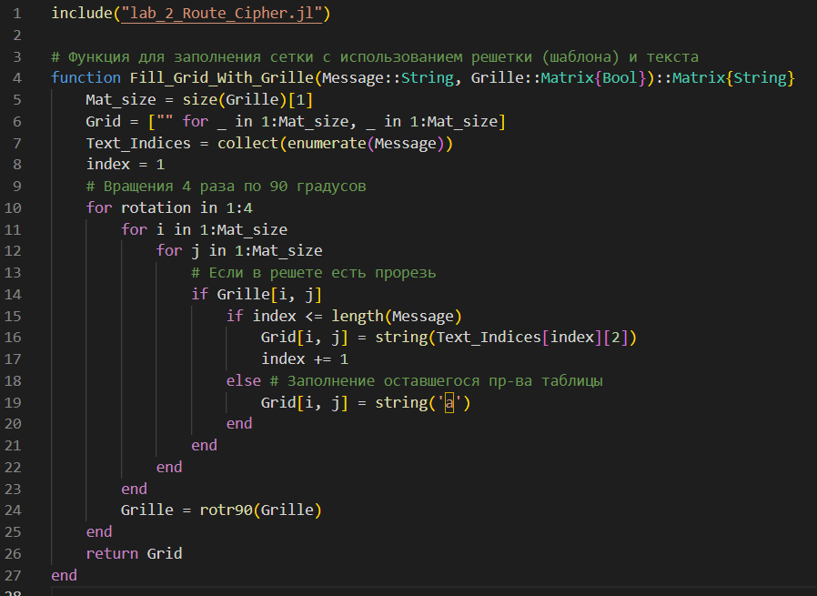{#fig:005 width=80%}

## Шифрование с помощью решеток (2/5)

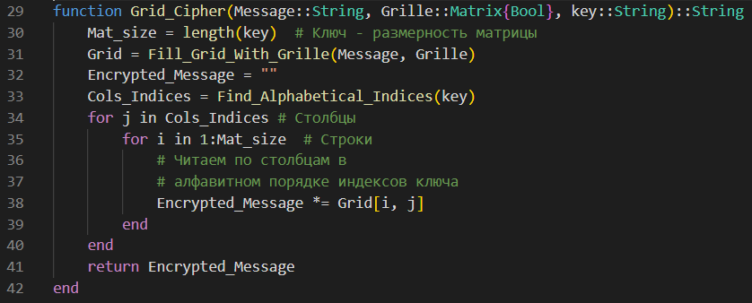{#fig:006 width=80%}

## Шифрование с помощью решеток (3/5)

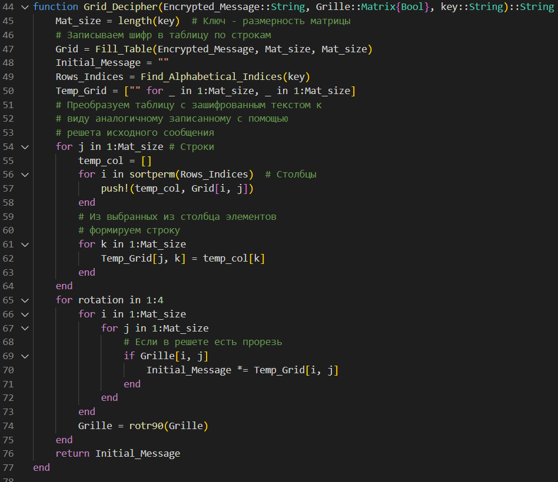{#fig:007 width=80%}

## Шифрование с помощью решеток (4/5)

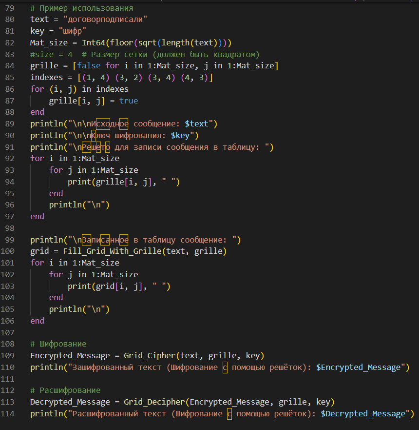{#fig:008 width=80%}

## Шифрование с помощью решеток (5/5)

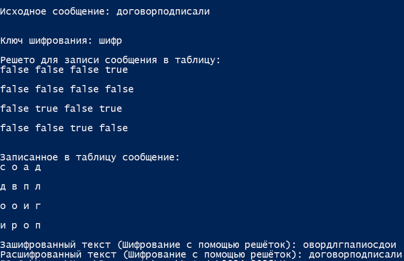{#fig:009 width=80%}

## Таблица Виженера (1/5)

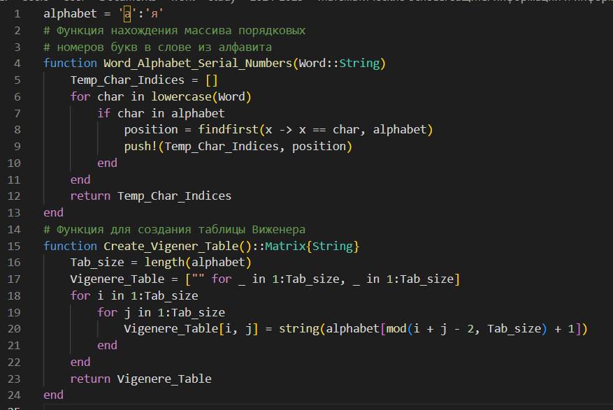{#fig:010 width=80%}

## Таблица Виженера (2/5)

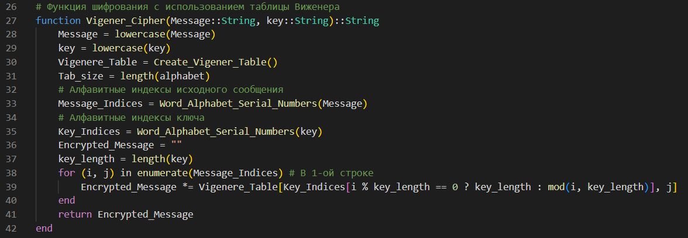{#fig:011 width=80%}

## Таблица Виженера (3/5)

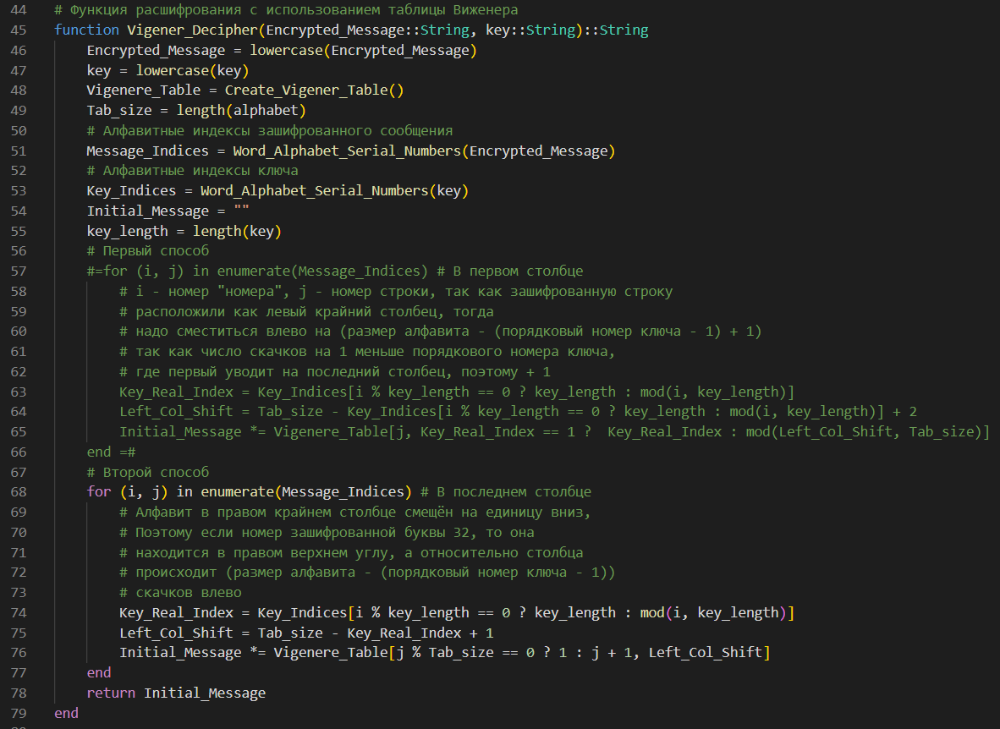{#fig:012 width=80%}

## Таблица Виженера (4/5)

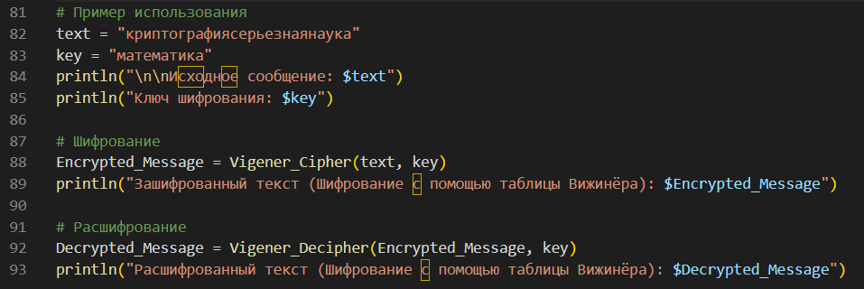{#fig:013 width=80%}

## Таблица Виженера (5/5)

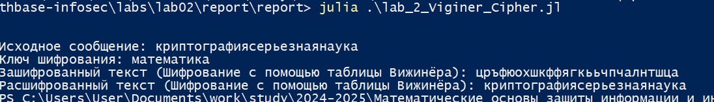{#fig:014 width=80%}

# Результаты

В ходе работы я изучил работу перестановочных шифров --- маршрутного шифрования, шифрования с помощью решёток и таблицы Вижинёра, а также реализовать их программно на языке Julia.
