---
## Front matter
title: "Лабораторная работа №2"
subtitle: "Математические основы защиты информации и информационной безопасности"
author: "Николаев Дмитрий Иванович, НПМмд-02-24"

## Generic otions
lang: ru-RU
toc-title: "Содержание"

## Bibliography
bibliography: bib/cite.bib
csl: pandoc/csl/gost-r-7-0-5-2008-numeric.csl

## Pdf output format
toc: true # Table of contents
toc-depth: 2
lof: true # List of figures
lot: true # List of tables
fontsize: 12pt
linestretch: 1.5
papersize: a4
documentclass: scrreprt
## I18n polyglossia
polyglossia-lang:
  name: russian
  options:
	- spelling=modern
	- babelshorthands=true
polyglossia-otherlangs:
  name: english
## I18n babel
babel-lang: russian
babel-otherlangs: english
## Fonts
mainfont: PT Serif
romanfont: PT Serif
sansfont: PT Sans
monofont: PT Mono
mainfontoptions: Ligatures=TeX
romanfontoptions: Ligatures=TeX
sansfontoptions: Ligatures=TeX,Scale=MatchLowercase
monofontoptions: Scale=MatchLowercase,Scale=0.9
## Biblatex
biblatex: true
biblio-style: "gost-numeric"
biblatexoptions:
  - parentracker=true
  - backend=biber
  - hyperref=auto
  - language=auto
  - autolang=other*
  - citestyle=gost-numeric
## Pandoc-crossref LaTeX customization
figureTitle: "Рис."
tableTitle: "Таблица"
listingTitle: "Листинг"
lofTitle: "Список иллюстраций"
lotTitle: "Список таблиц"
lolTitle: "Листинги"
## Misc options
indent: true
header-includes:
  - \usepackage{indentfirst}
  - \usepackage{float} # keep figures where there are in the text
  - \floatplacement{figure}{H} # keep figures where there are in the text
---

# Цель работы

Изучить работу шифров перестановки --- маршрутного шифрования, шифрования с помощью решёток и таблицы Вижинёра, а также реализовать их программно.

# Теоретическое введение

Шифры перестановки преобразуют открытый текст в криптограмму путем перестановки его символов. Способ, каким при шифровании переставляются буквы открытого текста, и является ключом шифра. Важным требованием является равенство длин ключа и исходного текста.

Существует два широко распространенных метода перестановок: маршрутное шифрование и шифрование с помощью решеток.

## Маршрутное шифрование

Данный способ шифрования разработал французский математик Франсуа Виет. Открытый текст записывают в некоторую геометрическую фигуру (обычно прямоугольник) по некоторому пути, а затем, выписывая символы по другому пути, получают шифротекст. Пусть $m$ и $n$ --- целые положительные числа, большие 1. Открытый текст разбивается на блоки равной длины, состоящие из числа символов, равного произведению $m \times n$. Если последний блок получится меньше остальных, то в него следует дописать требуемое количество произвольных символов. Составляется таблица размерности $mn$. Блоки вписываются построчно в таблицу. Криптограмма получается выписыванием букв из таблицы в соответствии с некоторым маршрутом. Ключом такой криптограммы является маршрут и числа $m$ и $n$. Обычно буквы выписывают по столбцам, которые упорядочивают согласно паролю: внизу таблицы приписывается слово из $n$ неповторяющихся букв и столбцы нумеруются по алфавитному порядку букв пароля.

Например, для шифрования текста "нельзя недооценивать противника", разобьем его на блоки длины $n = 6$. Блоков получится $m = 5$. К последнему блоку припишем букву "а". В качестве пароля выберем слово "пароль". Теперь будем выписывать буквы по столбцам в соответствии с алфавитным порядком букв пароля и получим следующую криптограмму:
ЕЕНПНЗОАТАЬОВОКННЕЬВЯЦТИА.

Рассмотренный способ шифрования (столбцовая перестановка) в годы первой мировой войны использовала легендарная немецкая шпионка Мата Хари.

## Шифрование с помощью решеток

Данный способ шифрования предложил австрийский криптограф Эдуард Флейснер в 1881 году. Суть этого способа заключается в следующем. Выбирается натуральное число $k > 1$, строится квадрат размерности $k$, который построчно заполняется числами $1, 2, ..., k^2$. В качестве примера рассмотрим квадрат размерности $k = 2$:

$$
\begin{array}{cc}
1 & 2 \\
3 & 4 \\
\end{array}
$$

Повернем его по часовой стрелке на 90° и присоединим к исходному квадрату справа:

$$
\begin{array}{cccc}
1 & 2 & 3 & 1 \\
3 & 4 & 4 & 2 \\
\end{array}
$$

Проделаем такую процедуру еще дважды и припишем получившиеся квадраты снизу. Получился большой квадрат размерности $2k \times 2k$.

$$
\begin{array}{cccc}
1 & 2 & 3 & 1 \\
3 & 4 & 4 & 2 \\
2 & 4 & 4 & 3 \\
1 & 3 & 2 & 1 \\
\end{array}
$$

Далее из большого квадрата вырезаются клетки, содержащие числа от 1 до $k^2$. В каждой клетке должно быть только одно число. Получается своего рода
решето. Шифрование осуществляется следующим образом. Решето накладывается на чистый квадрат $2k \times 2k$, и в прорези вписываются буквы исходного текста по порядку их следования. Когда заполнятся все прорези, решето поворачивается на 90° и вписывание букв продолжается. После третьего поворота все клетки большого квадрата окажутся заполненными. Подобрав подходящий пароль (число букв пароля должно равняться $k^2$, и они не должны повторяться), выпишем буквы по столбцам. Очередность столбцов определяется алфавитным порядком букв пароля.

Пример. Исходный текст --- "договор подписали", пароль --- "шифр".

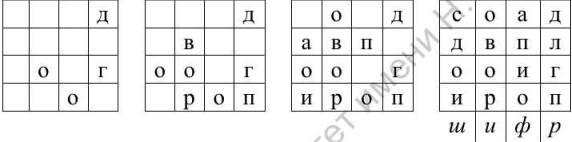{#fig:pic001 width=80%}

С применением вышеуказанной ([@fig:pic001]) решетки за пять шагов получаем следующую криптограмму: ОВОРДЛГПАПИОСДОИ.

Важно отметить, что число $k$ подбирается в соответствии с количеством букв $N$ исходного текста. В идеальном случае $k^2 = N$. Если такого равенства достичь невозможно, то можно либо дописать произвольную букву к последнему слову открытого текста, либо убрать её.

## Таблица Виженера

В 1585 году французский криптограф Блез Виженер опубликовал свой метод шифрования в "Трактате о шифрах". Шифр считался нераскрываемым до 1863 года, когда австриец Фридрих Казиски взломал его.

Открытый текст разбивается на блоки длины $n$. Ключ представляет собой последовательность из $n$ натуральных чисел: $a_1, a_2, ..., a_n$. Далее в каждом блоке первая буква циклически сдвигается вправо по алфавиту на $a_1$ позиций, вторая буква --- на $a_2$ позиций, последняя --- на $a_n$ позиций. Для лучшего запоминания в качестве ключа можно взять осмысленное слово, а алфавитные номера входящих в него букв использовать для осуществления сдвигов. Рассмотрим еще одну схему построения шифра Виженера. В таблице в строчках записаны буквы русского алфавита смещённые на соответсвующий номер строки (первая --- исходный алфавит). При переходе от одной строке к другой происходит циклический сдвиг на одну позицию.

Пример. Исходный текст -- "криптография серьезная наука", пароль -- "математика". Пароль записывается с повторениями над буквами сообщения ([@fig:pic002]):

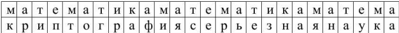{#fig:pic002 width=80%}

В итоге получается следующая криптограмма: ЦРЬФЯОХШКФФЯДКЭЬЧПЧАЛНТШЦА.

# Ход работы

Следуем указаниям из [@lab2].

## Маршрутное шифрование

Реализуем алгоритм маршрутного шифрования и его расшифрование на Julia ([@fig:001-@fig:003]), в результате получим следующий вывод ([@fig:004]).

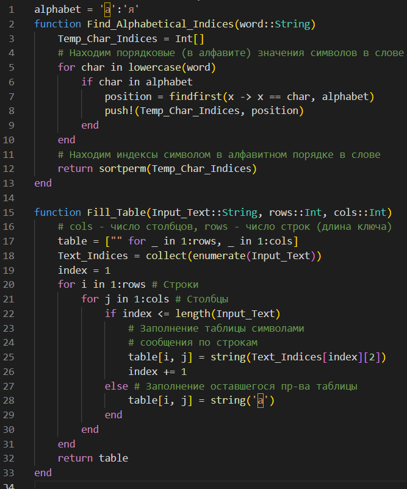{#fig:001 width=80%}

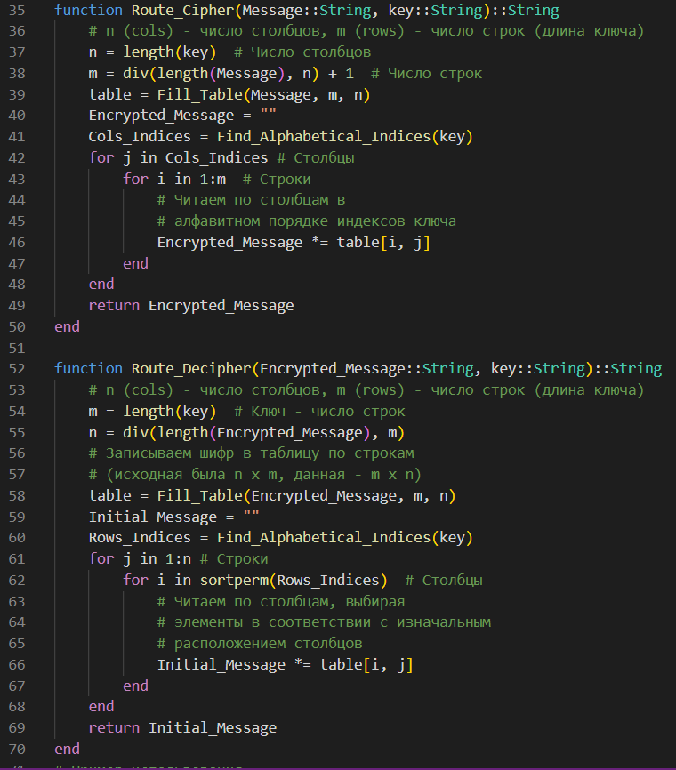{#fig:002 width=80%}

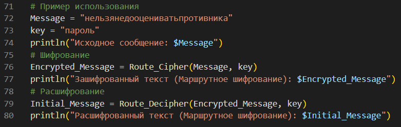{#fig:003 width=80%}

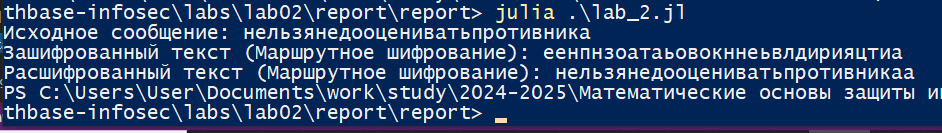{#fig:004 width=80%}

## Шифрование с помощью решеток

Реализуем алгоритм шифрования с помощью решёток и его расшифрование на Julia ([@fig:005-@fig:008]), в результате получим следующий вывод ([@fig:009]).

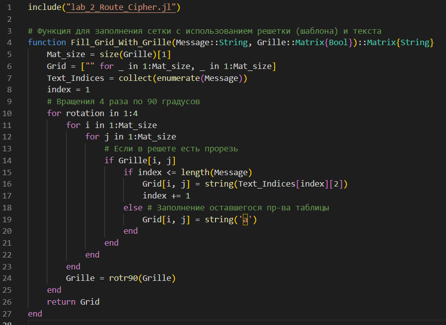{#fig:005 width=80%}

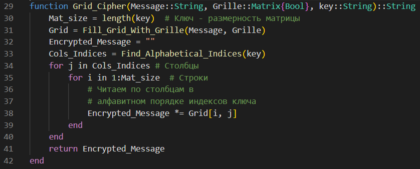{#fig:006 width=80%}

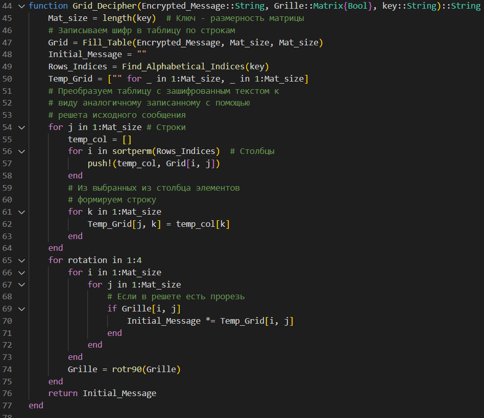{#fig:007 width=80%}

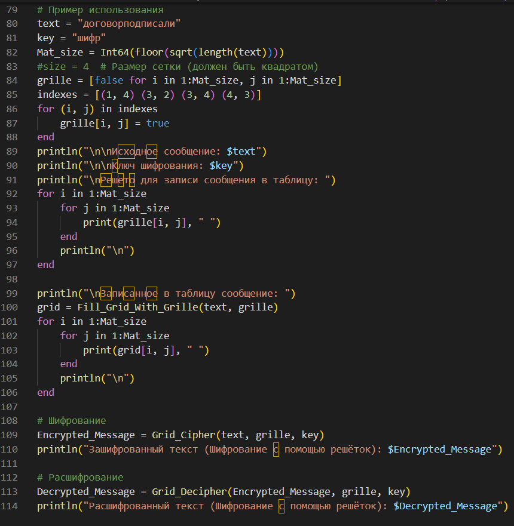{#fig:008 width=80%}

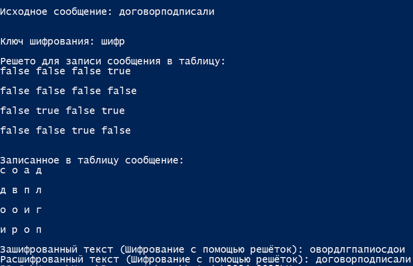{#fig:009 width=80%}

## Таблица Виженера

Реализуем алгоритм шифрования с помощью таблицы Вижинёра и его расшифрование на Julia ([@fig:010-@fig:013]), в результате получим следующий вывод ([@fig:014]).

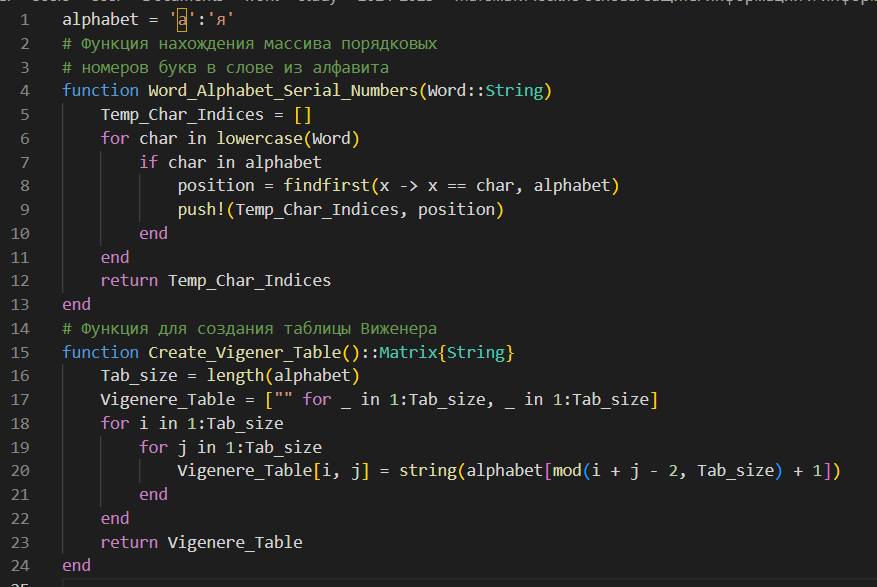{#fig:010 width=80%}

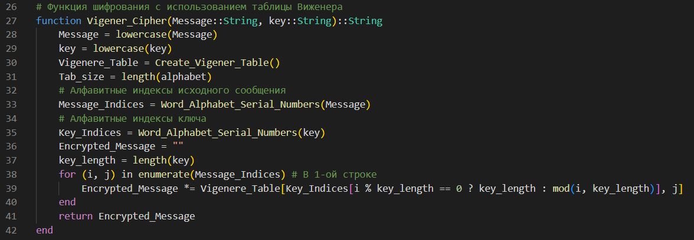{#fig:011 width=80%}

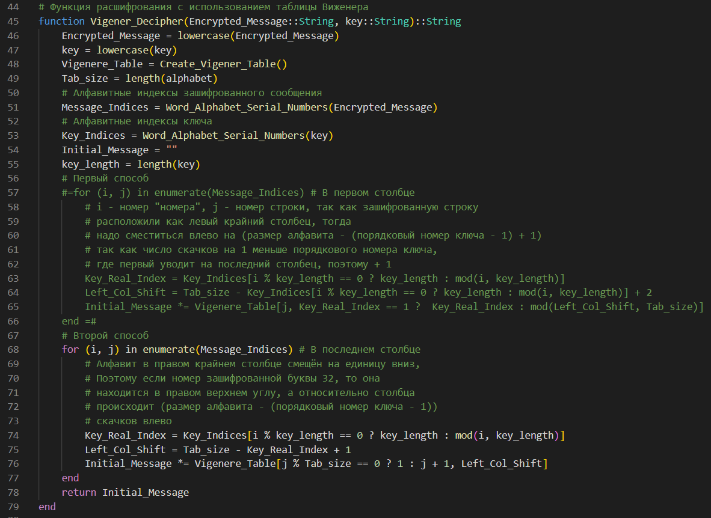{#fig:012 width=80%}

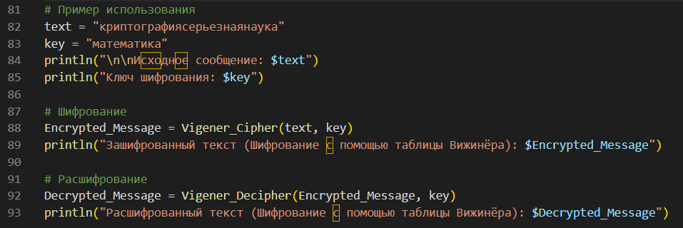{#fig:013 width=80%}

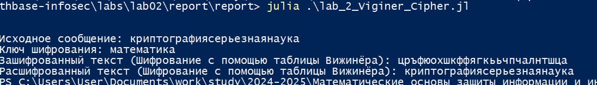{#fig:014 width=80%}

# Выводы

В ходе выполнения лабораторной работы я изучил работу перестановочных шифров --- маршрутного шифрования, шифрования с помощью решёток и таблицы Вижинёра, а также реализовать их программно на языке Julia.

# Список литературы{.unnumbered}

::: {#refs}
:::
