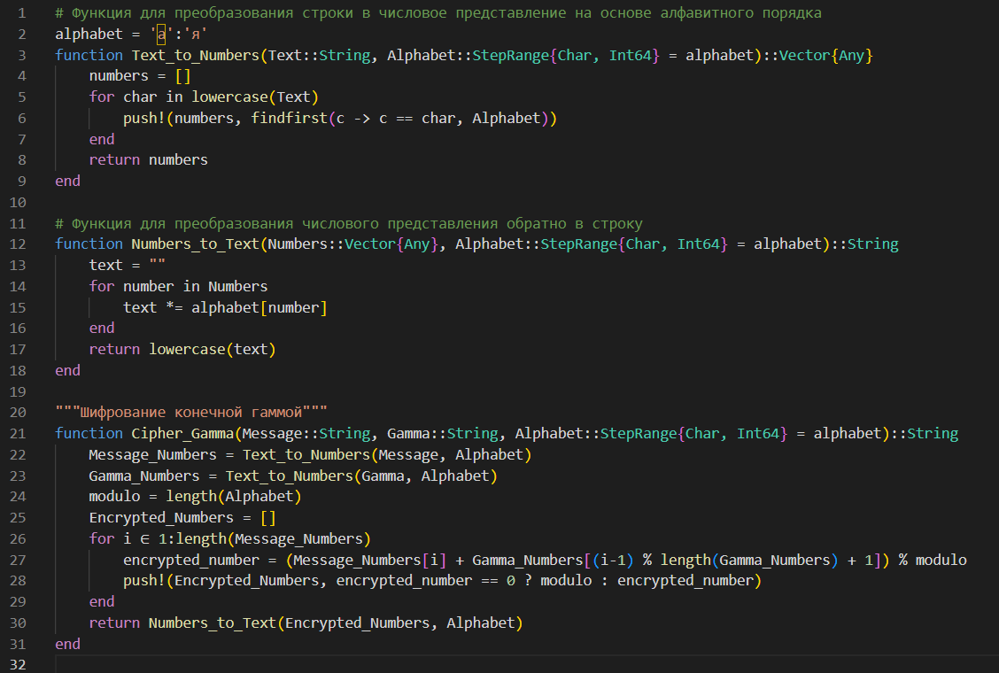
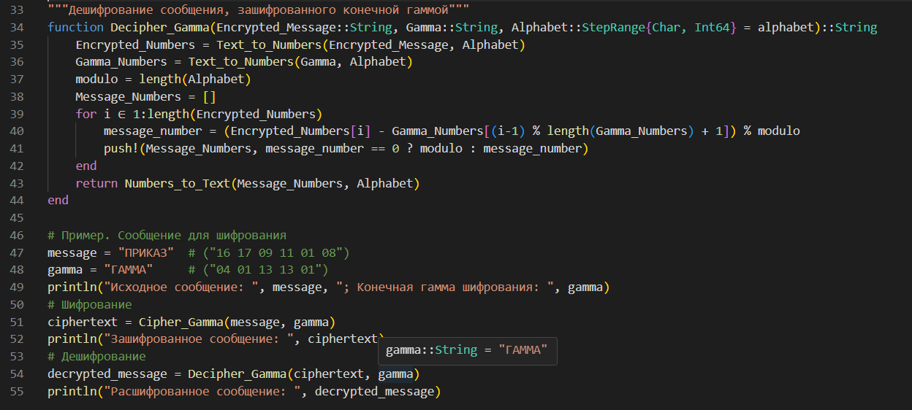
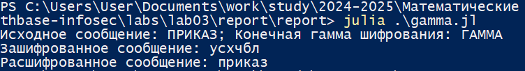

---
## Front matter
lang: ru-RU
title: Лабораторная работа №3
subtitle: Математические основы защиты информации и информационной безопасности
author:
  - Николаев Дмитрий Иванович, НПМмд-02-24
institute:
  - Российский университет дружбы народов имени Патриса Лумумбы, Москва, Россия
date: 29 сентября 2024

## i18n babel
babel-lang: russian
babel-otherlangs: english

## Formatting pdf
toc: false
toc-title: Содержание
slide_level: 2
aspectratio: 169
section-titles: true
theme: metropolis
header-includes:
 - \metroset{progressbar=frametitle,sectionpage=progressbar,numbering=fraction}
 - '\makeatletter'
 - '\beamer@ignorenonframefalse'
 - '\makeatother'
---

# Прагматика выполнения

- Освоение шифров гаммированием, в частности шифрование конечной гаммой.

# Цели

Изучить работу алгоритма шифрования гаммированием конечной гаммой, а также реализовать его программно.

# Задачи

1. Освоить и реализовать алгоритм шифрования гаммированием конечной гаммой на языке Julia.

# Выполнение работы

## Шифрование конечной гаммой на Julia (1/3)

{#fig:001 width=80%}

## Шифрование конечной гаммой на Julia (2/3)

{#fig:002 width=80%}

## Шифрование конечной гаммой на Julia (3/3)

{#fig:003 width=80%}

# Результаты

По результатам работы, я изучил работу алгоритма шифрования гаммированием конечной гаммой, а также реализовал его программно.
