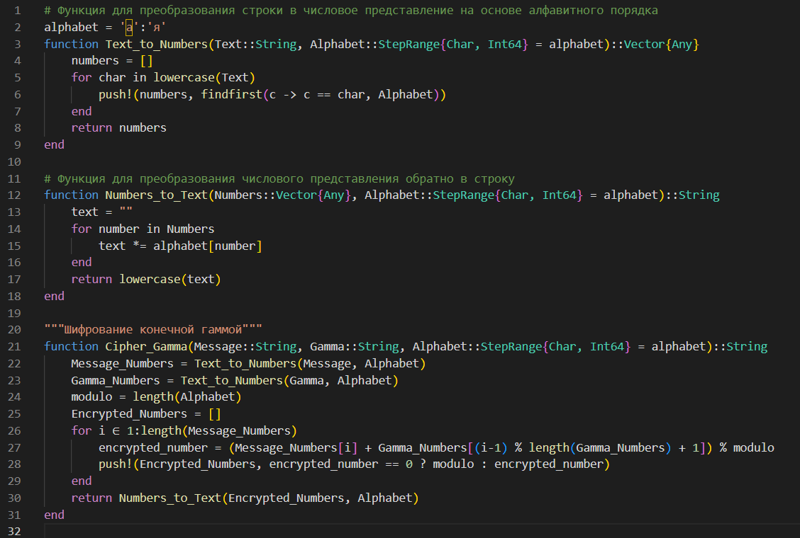
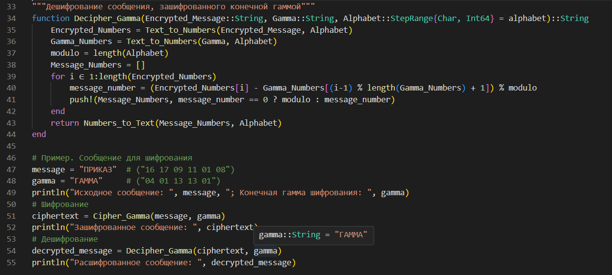
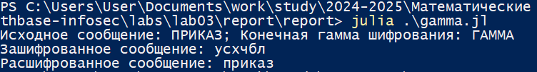

---
## Front matter
title: "Лабораторная работа №3"
subtitle: "Математические основы защиты информации и информационной безопасности"
author: "Николаев Дмитрий Иванович, НПМмд-02-24"

## Generic otions
lang: ru-RU
toc-title: "Содержание"

## Bibliography
bibliography: bib/cite.bib
csl: pandoc/csl/gost-r-7-0-5-2008-numeric.csl

## Pdf output format
toc: true # Table of contents
toc-depth: 2
lof: true # List of figures
lot: true # List of tables
fontsize: 12pt
linestretch: 1.5
papersize: a4
documentclass: scrreprt
## I18n polyglossia
polyglossia-lang:
  name: russian
  options:
	- spelling=modern
	- babelshorthands=true
polyglossia-otherlangs:
  name: english
## I18n babel
babel-lang: russian
babel-otherlangs: english
## Fonts
mainfont: PT Serif
romanfont: PT Serif
sansfont: PT Sans
monofont: PT Mono
mainfontoptions: Ligatures=TeX
romanfontoptions: Ligatures=TeX
sansfontoptions: Ligatures=TeX,Scale=MatchLowercase
monofontoptions: Scale=MatchLowercase,Scale=0.9
## Biblatex
biblatex: true
biblio-style: "gost-numeric"
biblatexoptions:
  - parentracker=true
  - backend=biber
  - hyperref=auto
  - language=auto
  - autolang=other*
  - citestyle=gost-numeric
## Pandoc-crossref LaTeX customization
figureTitle: "Рис."
tableTitle: "Таблица"
listingTitle: "Листинг"
lofTitle: "Список иллюстраций"
lotTitle: "Список таблиц"
lolTitle: "Листинги"
## Misc options
indent: true
header-includes:
  - \usepackage{indentfirst}
  - \usepackage{float} # keep figures where there are in the text
  - \floatplacement{figure}{H} # keep figures where there are in the text
---

# Цель работы

Изучить работу алгоритма шифрования гаммированием конечной гаммой, а также реализовать его программно.

# Теоретическое введение

## Шифрование гаммированием

Из всех схем шифрования простейшей и наиболее надежной является схема однократного использования. Формируется $m$- разрядная случайная двоичная последовательность --- ключ шифра. Отправитель производит побитовое сложение по модулю два (mod 2) ключа

$$
k = k_1 k_2 \dots k_i \dots k_m
$$
и $m$-разрядной двоичной последовательности:

$$
p = p_1 p_2 \dots p_i \dots p_m,
$$
соответствующей посылаемому сообщению:

$$
c_i = p_i \oplus k_i, i = \overline{1,m},
$$
где $p_i$ --- $i$-й бит исходного текста, $k_i$ --- $i$-й бит ключа, $\oplus$ -- операция побитового сложения (XOR), $c_i$ --- $i$-й бит получившейся криптограммы

$$
c = c_1 c_2 \dots c_i \dots c_m.
$$

Операция побитного сложения является обратимой, т.е. $(x \oplus y) \oplus y = x$, поэтому дешифрование осуществляется повторным применением операции $\oplus$ к криптограмме

$$
p_i = c_i \oplus k_i, i = \overline{1,m}.
$$

Основным недостатком такой схемы является равенство объема ключевой информации и суммарного объема передаваемых сообщений. Данный недостаток можно убрать, использовав ключ в качестве "зародыша", порождающего значительно более длинную ключевую последовательность.

Гаммирование --- процедура наложения при помощи некоторой функции $F$ на исходный текст гаммы шифра, т.е. псевдослучайной последовательности (ПСП) с выходом генератора $G$. Псевдослучайная последовательность по своим статистическим свойствам неотличима от случайной последовательности, но является детерминированной, т.е. известен алгоритм ее формирования. Чаще всего в качестве функции $F$ берется операция поразрядного сложения по модулю два или по модулю $N$ ($N$ --- число букв алфавита открытого текста).

Простейший генератор псевдослучайной последовательности можно представить рекуррентным соотношением:

$$
\gamma_i = a \cdot \gamma_{i-1} + b \text{ (mod } m\text{)}, i = 1,\dots, m,
$$
где $\gamma_i$ --- $i$-й член последовательности псевдослучайных чисел, $a$, $\gamma_0$, $b$ --- ключевые параметры. Такая последовательность состоит из целых чисел от $0$ до $m - 1$. Если элементы $\gamma_i$ и $\gamma_j$ совпадут, то совпадут и последующие участки: $\gamma_{i+1} = \gamma_{j+1}$, $\gamma_{i+2} = \gamma_{j+2}$. Таким образом, ПСП является периодической. Знание периода гаммы существенно облегчает криптоанализ. Максимальная длина периода равна $m$. Для ее достижения необходимо удовлетворить следующим условиям:

1. $b$ и $m$ --- взаимно простые числа;
2. $a - 1$ делится на любой простой делитель числа $m$;
3. $a - 1$ кратно 4, если $m$ кратно 4.

Стойкость шифров, основанных на процедуре гаммирования, зависит от характеристик гаммы --- длины и равномерности распределения вероятностей появления знаков гаммы.

При использовании генератора ПСП получаем бесконечную гамму. Однако, возможен режим шифрования конечной гаммы. В роли конечной гаммы может выступать фраза. Как и ранее, используется алфавитный порядок букв, т.е. буква "а" имеет порядковый номер 1, "б" --- 2 и т.д.

Например, зашифруем слово "ПРИКАЗ" ("16 17 09 11 01 08") гаммой "ГАММА" ("04 01 13 13 01"). Будем использовать операцию побитового сложения по модулю 33 (mod 33). Получаем:

$$
\begin{split}
c_1 = 16 + 4 \mod 33 = 20 \\
c_2 = 17 + 1 \mod 33 = 18 \\
c_3 = 9 + 13 \mod 33 = 22 \\
c_4 = 11 + 13 \mod 33 = 24 \\
c_5 = 1 + 1 \mod 33 = 2 \\
c_6 = 8 + 4 \mod 33 = 12
\end{split}
$$

Криптограмма: "УСХЧБЛ" ("20 18 22 24 02 12").

# Выполнение лабораторной работы

Следуя указаниям [-@lab3], реализуем алгоритм шифрования гаммированием конечной гаммой и его расшифрование на Julia ([@fig:001,@fig:002]), в результате получим следующий вывод ([@fig:003]).

{#fig:001 width=80%}

{#fig:002 width=80%}

{#fig:003 width=80%}

# Выводы

В ходе выполнения лабораторной работы я изучил работу алгоритма шифрования гаммированием конечной гаммой, а также реализовал его программно.

# Список литературы{.unnumbered}

::: {#refs}
:::
