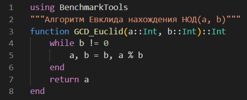
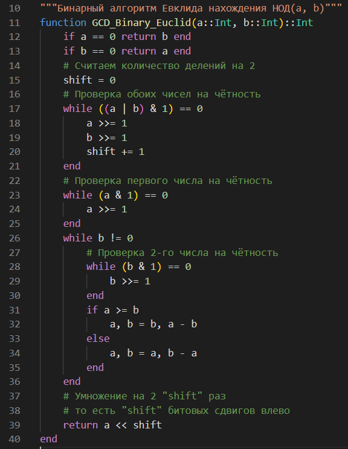
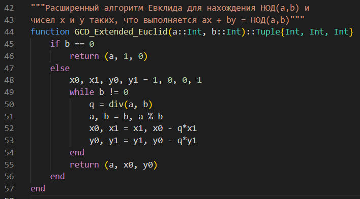
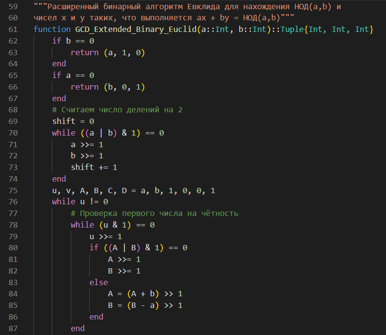
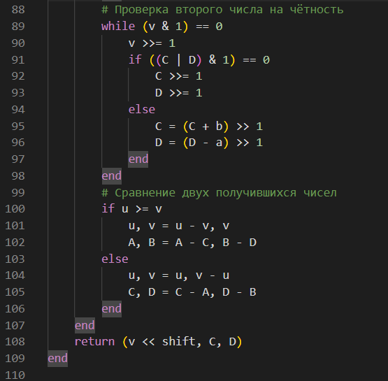
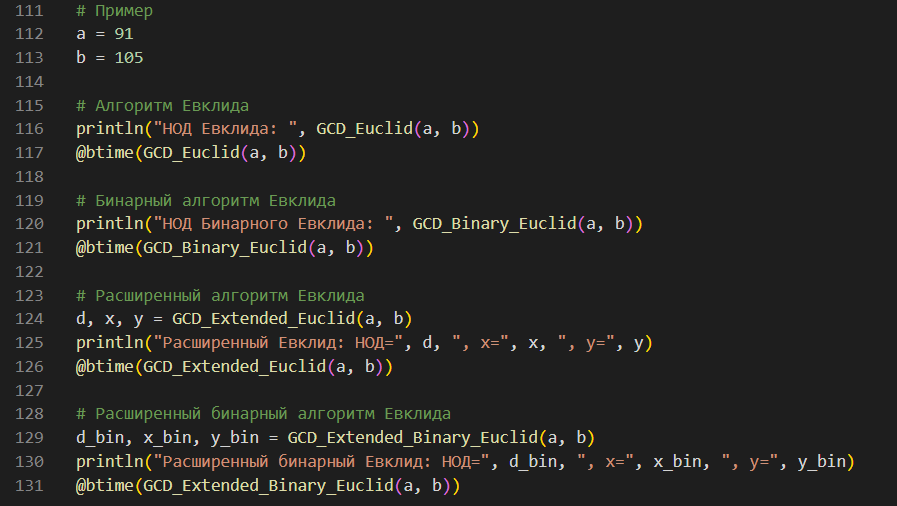
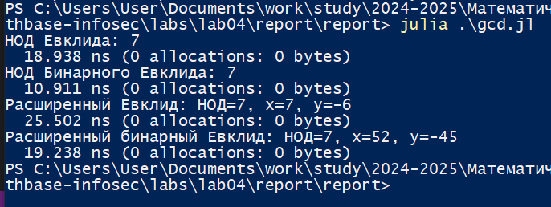

---
## Front matter
lang: ru-RU
title: Лабораторная работа №4
subtitle: Математические основы защиты информации и информационной безопасности
author:
  - Николаев Дмитрий Иванович, НПМмд-02-24
institute:
  - Российский университет дружбы народов имени Патриса Лумумбы, Москва, Россия
date: 29 сентября 2024

## i18n babel
babel-lang: russian
babel-otherlangs: english

## Formatting pdf
toc: false
toc-title: Содержание
slide_level: 2
aspectratio: 169
section-titles: true
theme: metropolis
header-includes:
 - \metroset{progressbar=frametitle,sectionpage=progressbar,numbering=fraction}
 - '\makeatletter'
 - '\beamer@ignorenonframefalse'
 - '\makeatother'
---

# Прагматика выполнения

- Освоение алгоритмов вычисления наибольшего общего делителя --- алгоритма Евклида, бинарного алгоритма Евклида, расширенного алгоритма Евклида, расширенного бинарного алгоритма Евклида

# Цели

Изучить работу алгоритмов вычисления наибольшего общего делителя: алгоритм Евклида, бинарный алгоритм Евклида, расширенный алгоритм Евклида, расширенный бинарный алгоритм Евклида, а также реализовать их программно.

# Задачи

1. Освоить и реализовать алгоритм Евклида на языке Julia;
2. Освоить и реализовать бинарный алгоритм Евклида на языке Julia;
3. Освоить и реализовать расширенный алгоритм Евклида на языке Julia;
4. Освоить и реализовать расширенный бинарный алгоритм Евклида на языке Julia.

# Выполнение работы

## Алгоритм Евклида

{#fig:001 width=70%}

## Бинарный алгоритм Евклида

{#fig:002 width=70%}

## Расщиренный алгоритм Евклида

{#fig:003 width=70%}

## Расщиренный бинарный алгоритм Евклида (1/2)

{#fig:004 width=70%}

## Расщиренный бинарный алгоритм Евклида (2/2)

{#fig:005 width=70%}

## Начальные данные

{#fig:006 width=70%}

## Результат выполнения кода и сравнения алгоритмов

{#fig:007 width=70%}

# Результаты

По результатам работы, я изучил работу алгоритмов вычисления наибольшего общего делителя: алгоритма Евклида, бинарного алгоритма Евклида, расширенного алгоритма Евклида, расширенного бинарного алгоритма Евклида, а также реализовал их программно.
