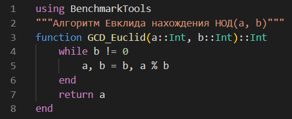
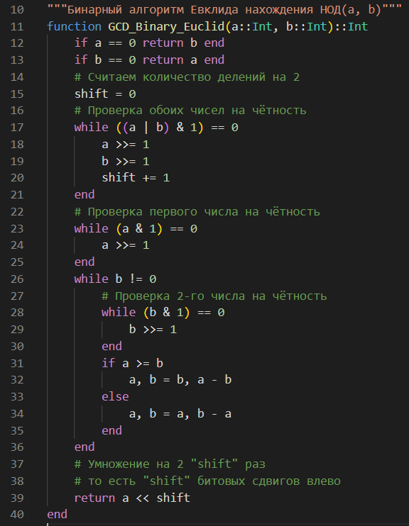
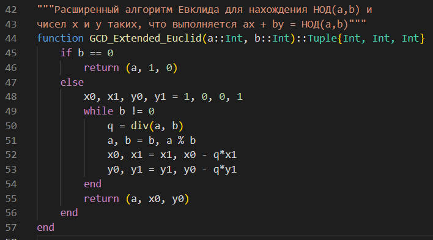
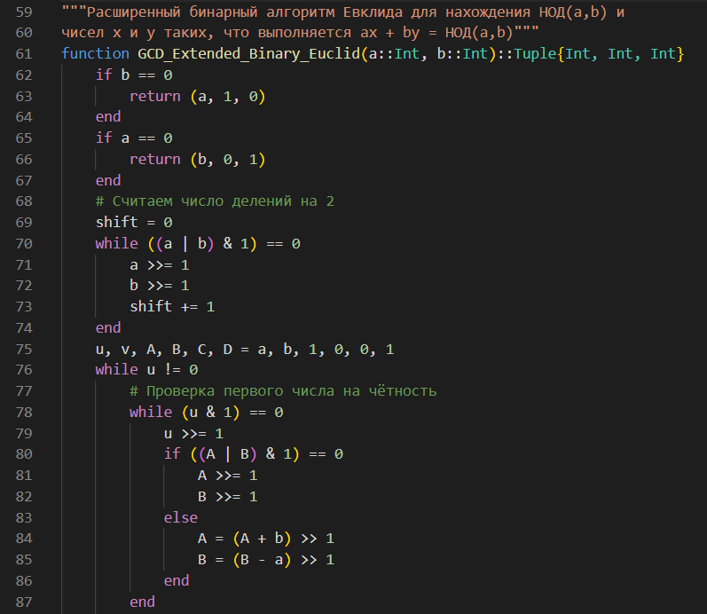
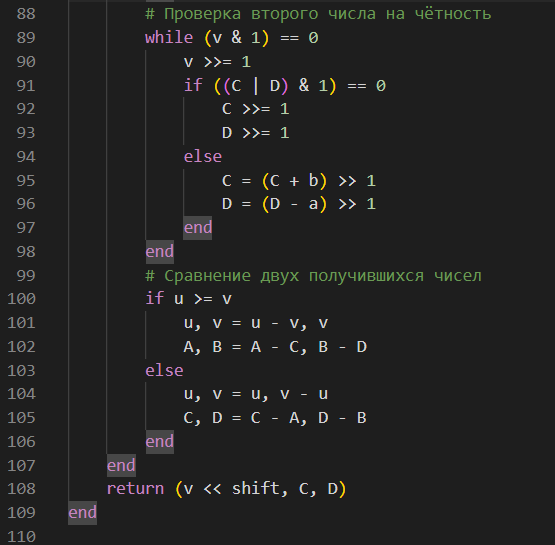
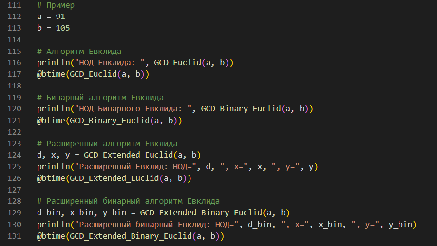
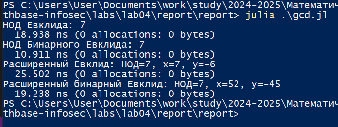

---
## Front matter
title: "Лабораторная работа №4"
subtitle: "Математические основы защиты информации и информационной безопасности"
author: "Николаев Дмитрий Иванович, НПМмд-02-24"

## Generic otions
lang: ru-RU
toc-title: "Содержание"

## Bibliography
bibliography: bib/cite.bib
csl: pandoc/csl/gost-r-7-0-5-2008-numeric.csl

## Pdf output format
toc: true # Table of contents
toc-depth: 2
lof: true # List of figures
lot: true # List of tables
fontsize: 12pt
linestretch: 1.5
papersize: a4
documentclass: scrreprt
## I18n polyglossia
polyglossia-lang:
  name: russian
  options:
	- spelling=modern
	- babelshorthands=true
polyglossia-otherlangs:
  name: english
## I18n babel
babel-lang: russian
babel-otherlangs: english
## Fonts
mainfont: PT Serif
romanfont: PT Serif
sansfont: PT Sans
monofont: PT Mono
mainfontoptions: Ligatures=TeX
romanfontoptions: Ligatures=TeX
sansfontoptions: Ligatures=TeX,Scale=MatchLowercase
monofontoptions: Scale=MatchLowercase,Scale=0.9
## Biblatex
biblatex: true
biblio-style: "gost-numeric"
biblatexoptions:
  - parentracker=true
  - backend=biber
  - hyperref=auto
  - language=auto
  - autolang=other*
  - citestyle=gost-numeric
## Pandoc-crossref LaTeX customization
figureTitle: "Рис."
tableTitle: "Таблица"
listingTitle: "Листинг"
lofTitle: "Список иллюстраций"
lotTitle: "Список таблиц"
lolTitle: "Листинги"
## Misc options
indent: true
header-includes:
  - \usepackage{indentfirst}
  - \usepackage{float} # keep figures where there are in the text
  - \floatplacement{figure}{H} # keep figures where there are in the text
---

# Цель работы

Изучить работу алгоритмов вычисления наибольшего общего делителя: алгоритм Евклида, бинарный алгоритм Евклида, расширенный алгоритм Евклида, расширенный бинарный алгоритм Евклида, а также реализовать их программно.

# Теоретическое введение

## Вычисление наибольшего общего делителя

Пусть числа $a$ и $b$ целые и $b \neq 0$. Разделить $a$ на $b$ с остатком --- значит представить $a$ в виде $a = q \cdot b + r$, где $q, r \in \mathbb{Z}$ и $0 \leq r \leq |b|$. Число $q$ называется неполным частным, число $r$ --- неполным остатком от деления $a$ на $b$.

Целое число $d \neq 0$ называется *наибольшим общим делителем* целых чисел $a_1, a_2,\dots, a_k$ (обозначается $d = \text{НОД}(a_1, a_2,\dots, a_k)$), если выполняются следующие условия:

1. каждое из чисел $a_1, a_2,\dots, a_k$ делится на $d$;
2. если $d_1 \neq 0$ --- другой общий делитель чисел $a_1, a_2,\dots, a_k$, то $d$ делится на $d_1$. Например, $\text{НОД}(12345, 24690) = 12345$, $\text{НОД}(12345, 54321) = 3$, $\text{НОД}(12345, 12541) = 1$.

Ненулевые целые числа $a$ и $b$ называются *ассоциированными* (обозначается $a \sim b$), если $a$ делится на $b$ и $b$ делится на $a$.

Для любых целых чисел $a_1, a_2,\dots, a_k$ существует наибольший общий делитель $d$, и его можно представить в виде *линейной комбинации* этих чисел:

$$
d = c_1 \cdot a_1 + c_2 \cdot a_2 + \dots + c_k \cdot a_k, \quad c_i \in \mathbb{Z}.
$$

Например, $\text{НОД}$ чисел $91$, $105$, $154$ равен $7$. В качестве линейного представления можно взять:

$$
7 = 7 \cdot 91 + (-6) \cdot 105 + 0 \cdot 154,
$$
$$
7 = 4 \cdot 91 + 1 \cdot 105 - 3 \cdot 154.
$$

Целые числа $a_1, a_2, \dots, a_k$ называются *взаимно простыми в совокупности*, если $\text{НОД}(a_1, a_2,\dots, a_k)=1$. Целые числа $a$ и $b$ называются *взаимно простыми*, если $\text{НОД}(a, b)=1$.

Целые числа $a_1, a_2,\dots, a_k$ называются *попарно взаимно простыми*, если $\text{НОД}(a_i, a_j)=1$ для всех $1 \leq i \neq j \leq k$.

## Алгоритмы вычисления наибольшего общего делителя

Для вычисления наибольшего общего делителя двух целых чисел применяется способ повторного деления с остатком, называемый **алгоритмом Евклида**.

### Алгоритм Евклида

**Вход:** целые числа $a$, $b$; $0 < b \leq a$.

**Выход:** $d = \text{НОД}(a, b)$.

1. Положить $r_0 \leftarrow a$, $r_1 \leftarrow b$, $i \leftarrow 1$.
2. Найти остаток $r_{i+1}$ от деления $r_{i-1}$ на $r_{i}$.
3. Если $r_{i+1} = 0$, то положить $d \leftarrow r_i$. В противном случае положить $i \leftarrow i+1$ и вернуться на шаг 2.
4. Результат: $d$.

### Бинарный алгоритм Евклида

**Бинарный алгоритм Евклида** является более быстрым при реализации на компьютере, поскольку использует двоичное представление чисел $a$ и $b$. Он основан на следующих свойствах наибольшего общего делителя (считаем, что $0 < b \leq a$):

1. Если оба числа $a$ и $b$ четные, то $\text{НОД}(a, b) = 2 \cdot \text{НОД}(\frac{a}{2}, \frac{b}{2})$.
2. Если $a$ --- нечетное, $b$ --- четное, то $\text{НОД}(a, b) = \text{НОД}(a, \frac{b}{2})$.
3. Если оба числа $a$ и $b$ нечетные и $a > b$, то $\text{НОД}(a, b) = \text{НОД}(a - b, b)$.
4. Если $a = b$, то $\text{НОД}(a, b) = a$.

**Вход:** целые числа $a$, $b$; $0 < b \leq a$.

**Выход:** $d = \text{НОД}(a, b)$.

1. Положить $g \leftarrow 1$.
2. Пока оба числа $a$ и $b$ четные, выполнять $a \leftarrow \frac{a}{2}$, $b \leftarrow \frac{b}{2}$, $g \leftarrow 2g$ до получения хотя бы одного нечетного значения $a$ или $b$.
3. Положить $u \leftarrow a$, $v \leftarrow b$.
4. Пока $u \neq 0$, выполнять следующие действия:
    1. Пока $u$ четное, полагать $u \leftarrow \frac{u}{2}$.
    2. Пока $v$ четное, полагать $v \leftarrow \frac{v}{2}$.
    3. При $u \geq v$, положить $u \leftarrow u - v$. В противном случае положить $v \leftarrow v - u$.
5. Положить $d \leftarrow v \cdot g$.
6. Результат: $d$.

### Расширенный алгоритм Евклида

**Вход:** целые числа $a$, $b$; $0 < b \leq a$.

**Выход:** $d = \text{НОД}(a, b)$ и такие целые числа $x$, $y$, что $ax + by = d$.

1. Положить $r_0 \leftarrow a$, $r_1 \leftarrow b$, $x_0 \leftarrow 1$, $x_1 \leftarrow 0$, $y_0 \leftarrow 0$, $y_1 \leftarrow 1$, $i \leftarrow 1$.
2. Разделить с остатком $r_{i-1}$ на $r_i$, получив $q_i$ и $r_{i+1}$: $r_{i-1} = q_i r_i + r_{i+1}$.
3. Если $r_{i+1} = 0$, то положить $d \leftarrow r_i$, $x \leftarrow x_i$, $y \leftarrow y_i$. В противном случае положить $x_{i+1} \leftarrow x_{i-1} - q_i x_i$, $y_{i+1} \leftarrow y_{i-1} - q_i y_i$, $i \leftarrow i+1$ и вернуться на шаг 2.
4. Результат: $d$, $x$, $y$.

### Расширенный бинарный алгоритм Евклида

**Вход:** целые числа $a$, $b$; $0 < b \leq a$.

**Выход:** $d = \text{НОД}(a, b)$.

1. Положить $g \leftarrow 1$.
2. Пока числа $a$ и $b$ четные, выполнять $a \leftarrow \frac{a}{2}$, $b \leftarrow \frac{b}{2}$, $g \leftarrow 2g$ до получения хотя бы одного нечетного значения $a$ или $b$.
3. Положить $u \leftarrow a$, $v \leftarrow b$, $A \leftarrow 1$, $B \leftarrow 0$, $C \leftarrow 0$, $D \leftarrow 1$.
4. Пока $u \neq 0$, выполнять следующие действия:
    1. Пока $u$ четное:
        1. Положить $u \leftarrow \frac{u}{2}$.
        2. Если $A$ и $B$ четные, то положить $A \leftarrow \frac{A}{2}$, $B \leftarrow \frac{B}{2}$. В противном случае положить $A \leftarrow \frac{A + b}{2}$, $B \leftarrow \frac{B - a}{2}$.
    2. Пока $v$ четное:
        1. Положить $v \leftarrow \frac{v}{2}$.
        2. Если $C$ и $D$ четные, то положить $C \leftarrow \frac{C}{2}$, $D \leftarrow \frac{D}{2}$. В противном случае положить $C \leftarrow \frac{C + b}{2}$, $D \leftarrow \frac{D - a}{2}$.
    3. Если $u \geq v$, положить $u \leftarrow u - v$, $A \leftarrow A - C$, $B \leftarrow B - D$. В противном случае положить $v \leftarrow v - u$, $C \leftarrow C - A$, $D \leftarrow D - B$.
5. Положить $d \leftarrow v \cdot g$, $x \leftarrow C$, $y \leftarrow D$.
6. Результат: $d$, $x$, $y$.

## Резюме алгоритмов

1. **Алгоритм Евклида**: Это классический алгоритм, который повторяет деление с остатком, пока остаток не станет нулевым. Возвращает последний ненулевой остаток как НОД.
2. **Бинарный алгоритм Евклида**: Использует четность чисел и побитовые сдвиги для ускорения вычислений. Преимущество этого алгоритма заключается в эффективной работе на компьютерах с двоичной арифметикой.
3. **Расширенный алгоритм Евклида**: Помимо нахождения НОД, этот алгоритм вычисляет коэффициенты линейной комбинации $ax + by = \text{НОД}(a, b)$.
4. **Расширенный бинарный алгоритм Евклида**: Сочетает подход бинарного алгоритма с расширенным, вычисляя также коэффициенты линейной комбинации, но с использованием более быстрых операций.

# Выполнение лабораторной работы

Действуя согласно [-@lab4], реализуем все описанные алгоритмы на языке Julia.

Программные реализации алгоритма Евклида (Рис.[@fig:001]), бинарного алгоритма Евклида (Рис.[@fig:002]), расширенного алгоритма Евклида (Рис.[@fig:003]) и расширенного бинарного алгоритма Евклида (Рис.[@fig:004,@fig:005]) представлены на соответствующих картинках. После чего на начальных данных $a = 91$, $b = 105$ и с помощью пакета `BenchmarkTools` сравнены алгоритмы нахождения наибольшего общего делителя (Рис.[@fig:006]), где результаты представлены на Рис.[@fig:007].

{#fig:001 width=70%}

{#fig:002 width=70%}

{#fig:003 width=70%}

{#fig:004 width=70%}

{#fig:005 width=70%}

{#fig:006 width=70%}

{#fig:007 width=70%}

# Выводы

В ходе выполнения лабораторной работы я изучил работу алгоритмов вычисления наибольшего общего делителя: алгоритма Евклида, бинарного алгоритма Евклида, расширенного алгоритма Евклида, расширенного бинарного алгоритма Евклида, а также реализовал их программно.

# Список литературы{.unnumbered}

::: {#refs}
:::
