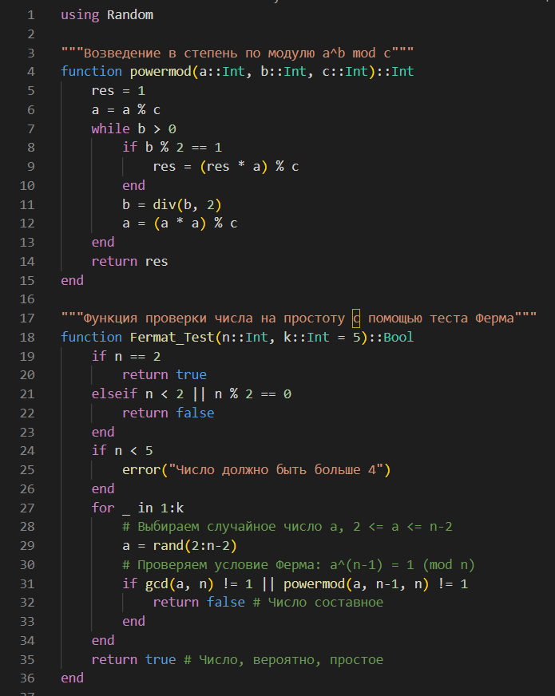
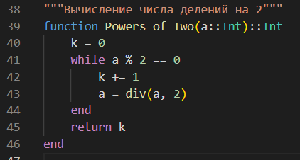
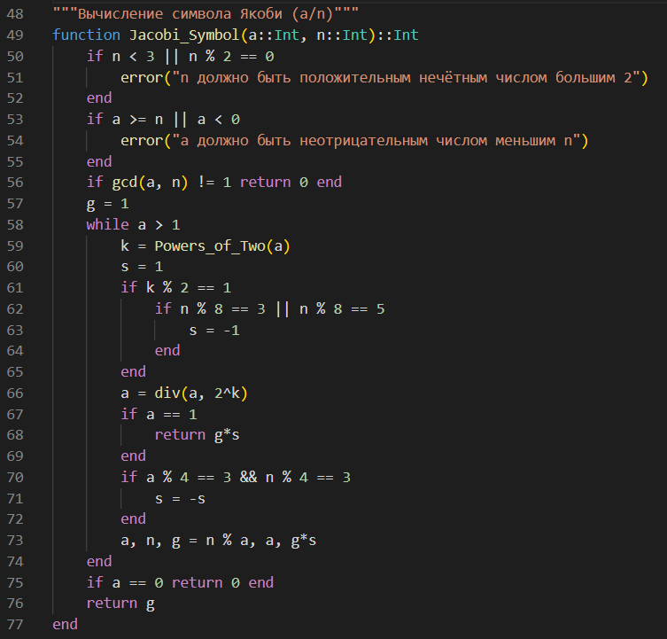
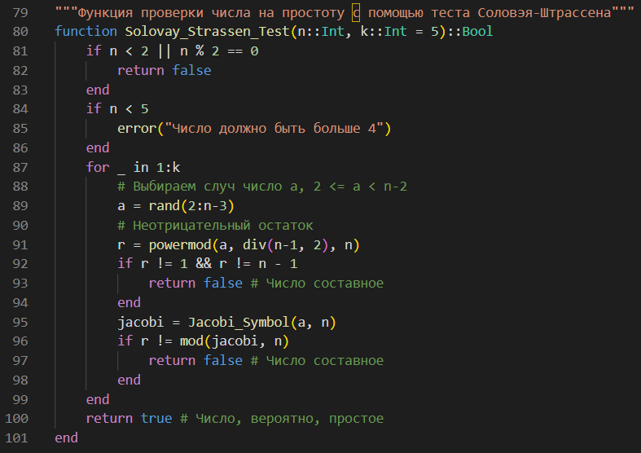
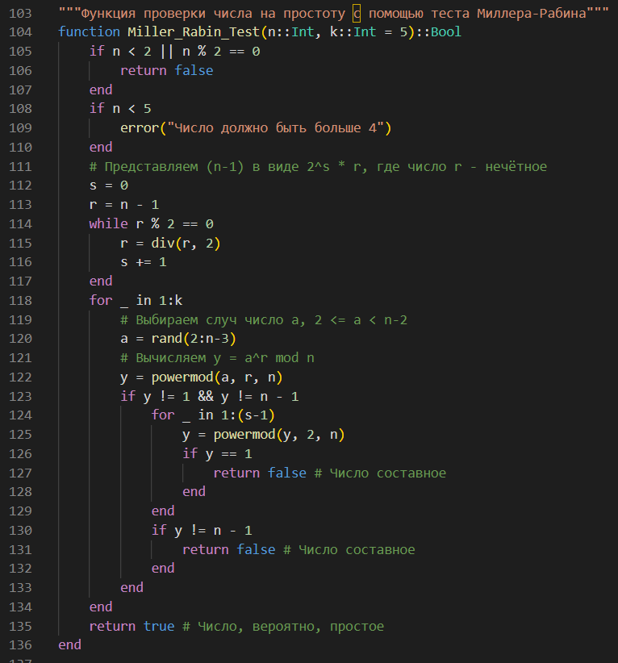
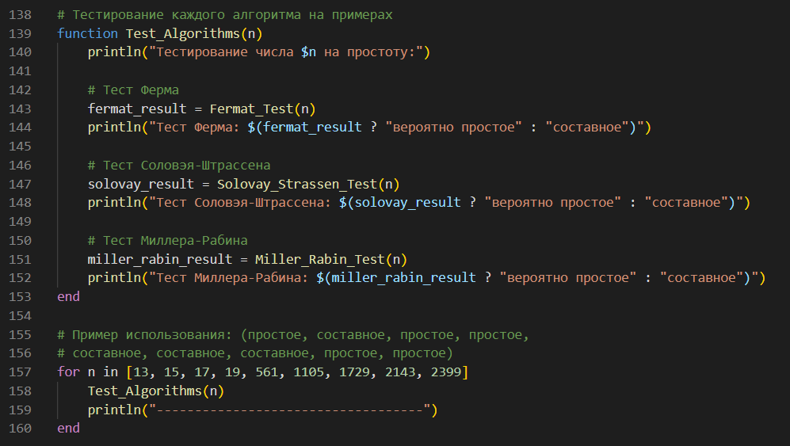
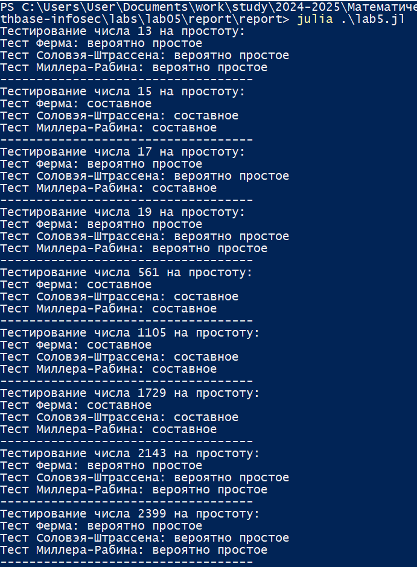

---
## Front matter
lang: ru-RU
title: Лабораторная работа №5
subtitle: Математические основы защиты информации и информационной безопасности
author:
  - Николаев Дмитрий Иванович, НПМмд-02-24
institute:
  - Российский университет дружбы народов имени Патриса Лумумбы, Москва, Россия
date: 8 ноября 2024

## i18n babel
babel-lang: russian
babel-otherlangs: english

## Formatting pdf
toc: false
toc-title: Содержание
slide_level: 2
aspectratio: 169
section-titles: true
theme: metropolis
header-includes:
 - \metroset{progressbar=frametitle,sectionpage=progressbar,numbering=fraction}
 - '\makeatletter'
 - '\beamer@ignorenonframefalse'
 - '\makeatother'
---

# Прагматика выполнения

- Освоение алгоритмов проверки чисел на простоту --- алгоритмов, реализующих тест Ферма, тест Соловэя-Штрассена, и тест Миллера-Рабина

# Цели

Изучить работу алгоритмов проверки чисел на простоту: алгоритм, реализующий тест Ферма; алгоритм вычисления символа Якоби; алгоритм, реализующий тест Соловэя-Штрассена; алгоритм, реализующий тест Миллера-Рабина; а также реализовать их программно.

# Задачи

1. Освоить и реализовать алгоритм, реализующий тест Ферма на языке Julia;
2. Освоить и реализовать алгоритм, реализующий тест Соловэя-Штрассена на языке Julia;
3. Освоить и реализовать алгоритм, реализующий тест Миллера-Рабина на языке Julia.

# Выполнение работы

## Алгоритм теста Ферма

{#fig:001 width=70%}

## Алгоритм теста Соловэя-Штрассена (1/3)

{#fig:002 width=70%}

## Алгоритм теста Соловэя-Штрассена (2/3)

{#fig:003 width=70%}

## Алгоритм теста Соловэя-Штрассена (3/3)

{#fig:004 width=70%}

## Алгоритм теста Миллера-Рабина

{#fig:005 width=70%}

## Начальные данные

{#fig:006 width=70%}

## Результат выполнения кода и сравнения алгоритмов

{#fig:007 width=70%}

# Результаты

По результатам работы, я изучил работу алгоритмов проверки чисел на простоту: алгоритма, реализующего тест Ферма; алгоритма вычисления символа Якоби; алгоритма, реализующего тест Соловэя-Штрассена; алгоритма, реализующего тест Миллера-Рабина; а также реализовал их программно на языке Julia.
