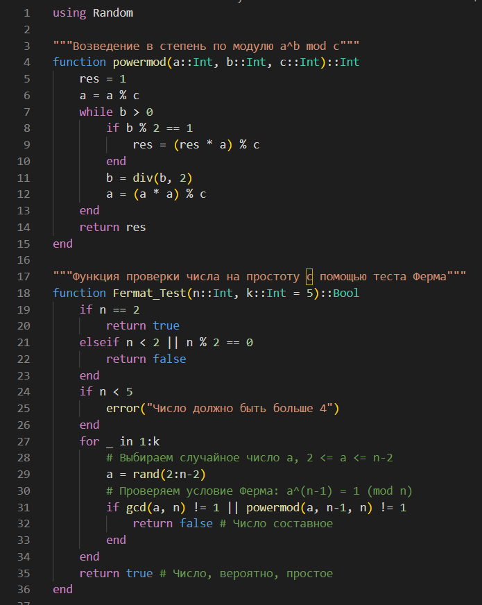
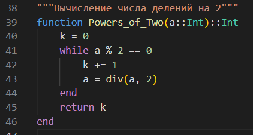
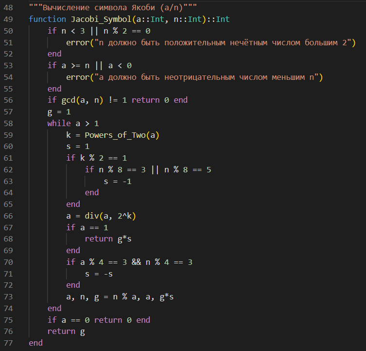
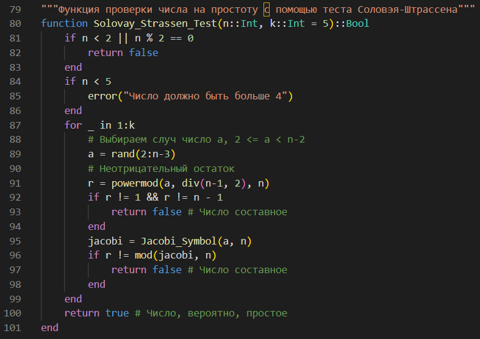
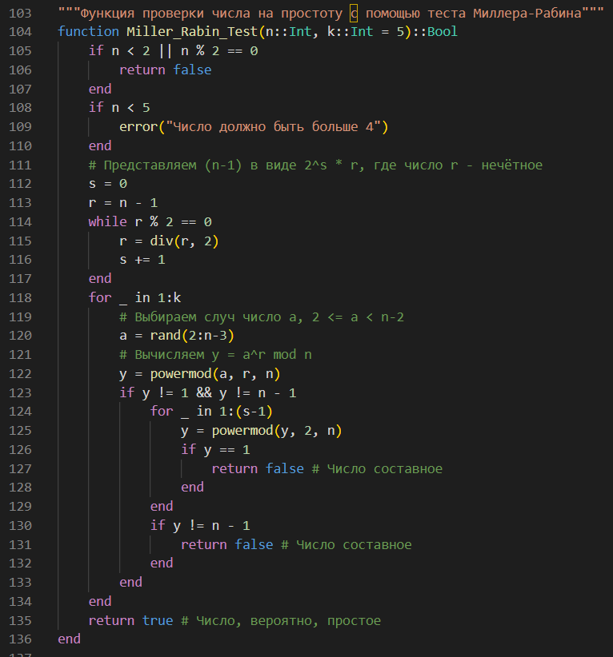
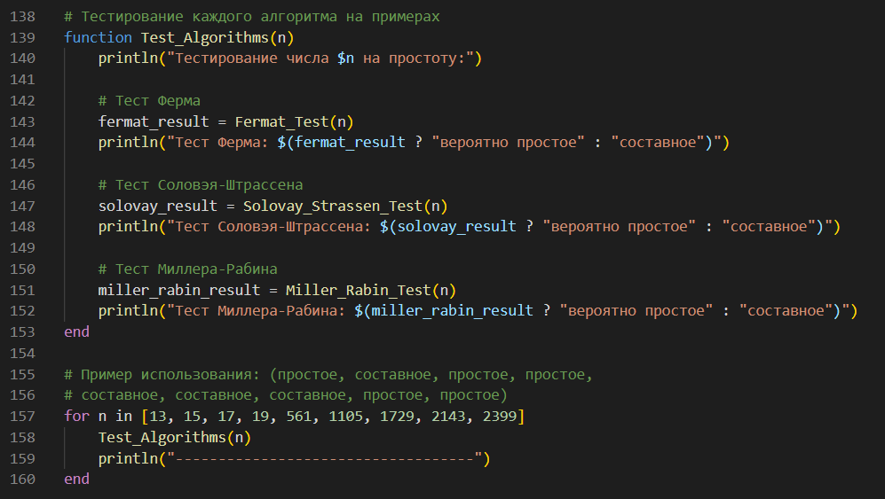
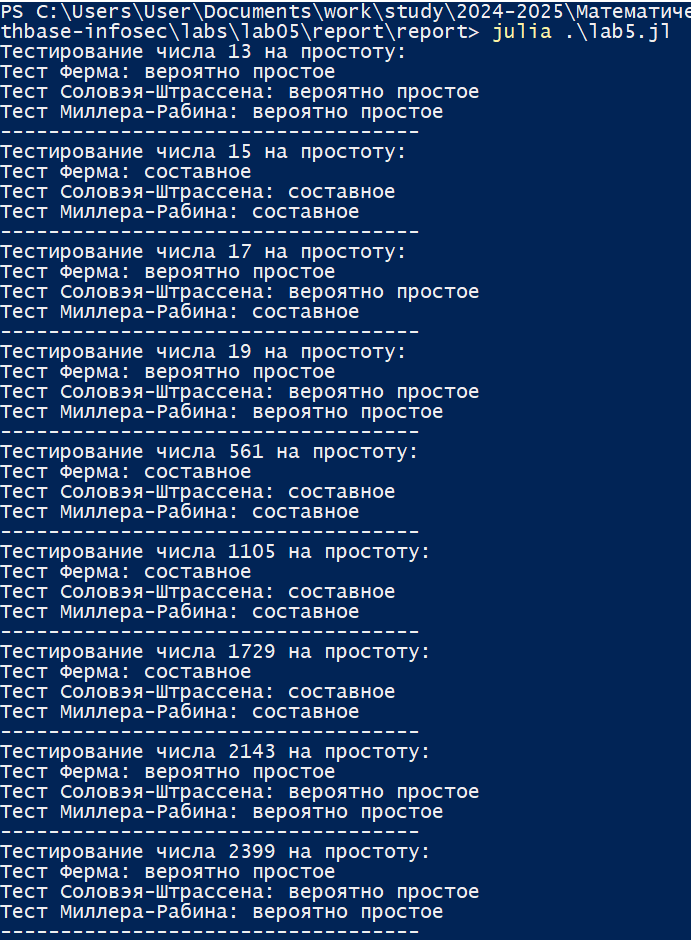

---
## Front matter
title: "Лабораторная работа №5"
subtitle: "Математические основы защиты информации и информационной безопасности"
author: "Николаев Дмитрий Иванович, НПМмд-02-24"

## Generic otions
lang: ru-RU
toc-title: "Содержание"

## Bibliography
bibliography: bib/cite.bib
csl: pandoc/csl/gost-r-7-0-5-2008-numeric.csl

## Pdf output format
toc: true # Table of contents
toc-depth: 2
lof: true # List of figures
lot: true # List of tables
fontsize: 12pt
linestretch: 1.5
papersize: a4
documentclass: scrreprt
## I18n polyglossia
polyglossia-lang:
  name: russian
  options:
	- spelling=modern
	- babelshorthands=true
polyglossia-otherlangs:
  name: english
## I18n babel
babel-lang: russian
babel-otherlangs: english
## Fonts
mainfont: PT Serif
romanfont: PT Serif
sansfont: PT Sans
monofont: PT Mono
mainfontoptions: Ligatures=TeX
romanfontoptions: Ligatures=TeX
sansfontoptions: Ligatures=TeX,Scale=MatchLowercase
monofontoptions: Scale=MatchLowercase,Scale=0.9
## Biblatex
biblatex: true
biblio-style: "gost-numeric"
biblatexoptions:
  - parentracker=true
  - backend=biber
  - hyperref=auto
  - language=auto
  - autolang=other*
  - citestyle=gost-numeric
## Pandoc-crossref LaTeX customization
figureTitle: "Рис."
tableTitle: "Таблица"
listingTitle: "Листинг"
lofTitle: "Список иллюстраций"
lotTitle: "Список таблиц"
lolTitle: "Листинги"
## Misc options
indent: true
header-includes:
  - \usepackage{indentfirst}
  - \usepackage{float} # keep figures where there are in the text
  - \floatplacement{figure}{H} # keep figures where there are in the text
---

# Цель работы

Изучить работу алгоритмов проверки чисел на простоту: алгоритм, реализующий тест Ферма; алгоритм вычисления символа Якоби; алгоритм, реализующий тест Соловэя-Штрассена; алгоритм, реализующий тест Миллера-Рабина; а также реализовать их программно.

# Теоретическое введение

## Вероятностные алгоритмы проверки чисел на простоту

Пусть $a$ --- целое число. Числа $ \pm 1, \pm a$ называются *тривиальными делителями* числа $a$.

Целое число $p \in \mathbb{Z}\backslash \{0\}$ называется *простым*, если оно не является делителем единицы и не имеет других делителей, кроме тривиальных. В противном случае число $p \in \mathbb{Z}\backslash \{-1,0,1\}$ называется *составным*.

Например, числа $\pm 2, \pm 3, \pm 5, \pm 7, \pm 11, \pm 13, \pm 17, \pm 19, \pm 23, \pm 29$ являются простыми.

Пусть $m \in \mathbb{N}, m > 1$. Целые числа $a$ и $b$ называются сравнимыми по модулю $m$ (обозначается $a \equiv b \pmod{m}$), если разность $a - b$ делится на $m$. Также эта процедура называется нахождением остатка от целочисленного деления $a$ на $m$.

Проверка чисел на простоту является составной частью алгоритмов генерации простых чисел, применяемых в криптографии с открытым ключом. Алгоритмы проверки на простоту можно разделить на вероятностные и детерминированные.

*Детерминированный* алгоритм всегда действует по одной и той же схеме и гарантированно решает поставленную задачу (или не дает никакого ответа).

*Вероятностный* алгоритм использует генератор случайных чисел и дает негарантированно точный ответ. Вероятностные алгоритмы в общем случае не менее эффективны, чем детерминированные (если используемый генератор случайных чисел всегда дает набор одних и тех же чисел, зависящих от входных данных, то вероятностный алгоритм становится детерминированным).

Для проверки на простоту числа $n$ вероятностным алгоритмом выбирают случайное число $a$ ($1 < a < n$) и проверяют условия алгоритма. Если число $n$ не проходит тест по основанию $a$, то алгоритм выдает результат «Число $n$ составное», и число $n$ действительно является составным.

Если же $n$ проходит тест по основанию $a$, ничего нельзя сказать о том, действительно ли число $n$ является простым. Последовательно проведя ряд проверок таким тестом для разных $a$ и получив для каждого из них ответ «Число $n$ вероятно, простое», можно утверждать, что число $n$ является простым с вероятностью, близкой к 1. После $t$ независимых выполнений теста вероятность того, что составное число $n$ будет $t$ раз объявлено простым (вероятность ошибки), не превосходит $\displaystyle\frac{1}{2^t}$.

### Алгоритм, реализующий тест Ферма

Тест Ферма основан на малой теореме Ферма: для простого числа $p$ и произвольного числа $a$, $1 \leq a \leq p - 1$, выполняется сравнение

$$
a^{p-1} \equiv 1 \pmod{p}
$$

Следовательно, если для нечётного $n$ существует такое целое $a$, что $1 < a < n$, $\text{НОД}(a, n) = 1$ и $a^{n-1} \not\equiv 1 \pmod{n}$, то число $n$ составное. Отсюда получаем следующий вероятностный алгоритм проверки числа на простоту.

**Вход**: Нечётное целое число $n \geq 5$.  
**Выход**: «Число $n$, вероятно, простое» или «Число $n$ составное».

1. Выбрать случайное целое число $a$, $2 \leq a \leq n - 2$.
2. Вычислить $r \leftarrow a^{n-1} \pmod{n}$.
3. При $r = 1$ результат: «Число $n$, вероятно, простое». В противном случае результат: «Число $n$ составное».

На шаге 1 мы не рассматривали числа $a = 1$ и $a = n - 1$, поскольку $1^{n-1} \equiv 1 \pmod{n}$ для любого целого $n$ и $(n - 1)^{n - 1} \equiv (-1)^{n - 1} \equiv 1 \pmod{n}$ для любого нечётного $n$.

### Алгоритм вычисления символа Якоби

**Вход**: Нечётное целое число $n \geq 3$, целое число $a$, $0 \leq a < n$.  
**Выход**: Символ Якоби $\displaystyle\left(\frac{a}{n}\right)$.

1. Положить $g \leftarrow 1$.
2. При $a = 0$ результат: $0$.
3. При $a = 1$ результат: $g$.
4. Представить $a$ в виде $a = 2^k a_1$, где число $a_1$ нечётное.
5. При четном $k$ положить $s \leftarrow 1$, при нечётном $k$ положить $s \leftarrow 1$, если $n \equiv \pm 1 \pmod{8}$; положить $s \leftarrow -1$, если $n \equiv \pm 3 \pmod{8}$.
6. При $a_1 = 1$ результат: $g \cdot s$.
7. Если $n \equiv 3 \pmod{4}$ и $a_1 \equiv 3 \pmod{4}$, то $s \leftarrow -s$.
8. Положить $a \leftarrow n \pmod{a_1}$, $n \leftarrow a_1$, $g \leftarrow g \cdot s$ и вернуться на шаг 2.

### Алгоритм, реализующий тест Соловэя-Штрассена

*Тест Соловэя-Штрассена* основан на критерии Эйлера: нечётное число $n$ является простым тогда и только тогда, когда для любого целого числа $a$, $1 \leq a \leq n - 1$, взаимно простого с $n$, выполняется сравнение:

$$
a^{\textstyle\frac{n-1}{2}} \equiv \left(\frac{a}{n}\right) \pmod{n},
$$
где $\displaystyle\left(\frac{a}{n}\right)$ --- *символ Якоби*.

Пусть $m, n \in \mathbb{Z}$, где $n = p_1 p_2 \dots p_r$ и числа $p_i \neq 2$ простые (не обязательно различные). *Символ Якоби* $\displaystyle\left(\frac{m}{n}\right)$ определяется равенством

$$
\displaystyle\left(\frac{m}{n}\right) = \left(\frac{m}{p_1}\right) \left(\frac{m}{p_2}\right) \dots \left(\frac{m}{p_r}\right).
$$

**Вход**: Нечётное целое число $n > 5$.  
**Выход**: «Число $n$, вероятно, простое» или «Число $n$ составное».

1. Выбрать случайное целое число $a$, $2 \leq a < n - 2$.
2. Вычислить $\displaystyle r \leftarrow a^{\textstyle\frac{n-1}{2}} \pmod{n}$.
3. При $r \neq 1$ и $r \neq n - 1$ результат: «Число $n$ составное».
4. Вычислить символ Якоби $s \leftarrow \displaystyle\left(\frac{a}{n}\right)$.
5. При $r \equiv s \pmod{n}$ результат: «Число $n$ составное». В противном случае результат: «Число $n$ вероятно, простое».

### Алгоритм, реализующий тест Миллера-Рабина

На сегодняшний день для проверки чисел на простоту чаще всего используется тест Миллера-Рабина, основанный на следующем наблюдении. Пусть число $n$ нечётное и $n - 1 = 2^s r$, где $r$ --- нечётное. Если $n$ простое, то для любого $a \geq 2$, взаимно простого с $n$, выполняется условие $a^{p-1} \equiv 1 \pmod{p}$.

**Вход**: Нечётное целое число $n \geq 5$.  
**Выход**: «Число $n$, вероятно, простое» или «Число $n$ составное».

1. Представить $n - 1$ в виде $n - 1 = 2^s r$, где число $r$ нечётное.
2. Выбрать случайное целое число $a$, $2 \leq a < n - 2$.
3. Вычислить $y \leftarrow a^r \pmod{n}$.
4. При $y \neq 1$ и $y \neq n - 1$ выполнить следующие действия:
    1. Положить $j \leftarrow 1$.
    2. Если $j \leq s - 1$ и $y \neq n - 1$, то:
        1. Положить $y \leftarrow y^2 \pmod{n}$.
        2. При $y = 1$ результат: «Число $n$ составное».
        3. Положить $j \leftarrow j + 1$.
    3. При $y \neq n - 1$ результат: «Число $n$ составное».
5. Результат: «Число $n$, вероятно, простое».

## Резюме алгоритмов

1. **Тест Ферма**: Этот алгоритм проверяет, удовлетворяет ли случайное число $a$ соотношению $a^{n-1} \equiv 1 \pmod{n}$, где $1 < a < n$.
Если это условие не выполняется, число составное.
2. **Символ Якоби**: Функция вычисляет символ Якоби $\displaystyle\left(\frac{a}{n}\right)$ рекурсивно, используя свойства сравнения и перестановки чисел по модулю.
3. **Тест Соловэя-Штрассена**: Использует символ Якоби для проверки условия $a^{\textstyle\frac{n-1}{2}} \equiv \displaystyle\left(\frac{a}{n}\right) \pmod{n}$. Если это условие не выполняется для какого-либо $a$, число составное.
4. **Тест Миллера-Рабина**: Использует разложение $n-1$ на $2^s \cdot r$ и проверяет условия для случайных $a$, используя возведение в степень по модулю. Этот тест считается более надежным и чаще используется.

# Выполнение лабораторной работы

Действуя согласно [-@lab5], реализуем все описанные алгоритмы проверки чисел на простоту на языке Julia.

Сначала реализуем функцию модульного экспоненциирования и алгоритм теста Ферма (Рис.[@fig:001]). Для реализации алгоритма теста Соловэя-Штрассена (Рис.[@fig:004]) предварительно определим функции вычисления числа делений некоторого заданного числа на 2 (Рис.[@fig:002]) и символа Якоби (Рис.[@fig:003]). После чего реализуем алгоритм Миллера-Рабина (Рис.[@fig:005]). Для следующего набора чисел: 13 - простое, 15 - составное, 17 - простое, 19 - простое, 561 - составное, 1105 - составное, 1729 - составное, 2143 - простое, 2399 - простое (Рис.[@fig:006]), проверим работу данных алгоритмов, в результате чего получим следующий вывод, представленный на Рис.[@fig:007].

{#fig:001 width=70%}

{#fig:002 width=70%}

{#fig:003 width=70%}

{#fig:004 width=70%}

{#fig:005 width=70%}

{#fig:006 width=70%}

{#fig:007 width=70%}

# Выводы

В ходе выполнения лабораторной работы я изучил работу алгоритмов проверки чисел на простоту: алгоритма, реализующего тест Ферма; алгоритма вычисления символа Якоби; алгоритма, реализующего тест Соловэя-Штрассена; алгоритма, реализующего тест Миллера-Рабина; а также реализовал их программно на языке Julia.

# Список литературы{.unnumbered}

::: {#refs}
:::
