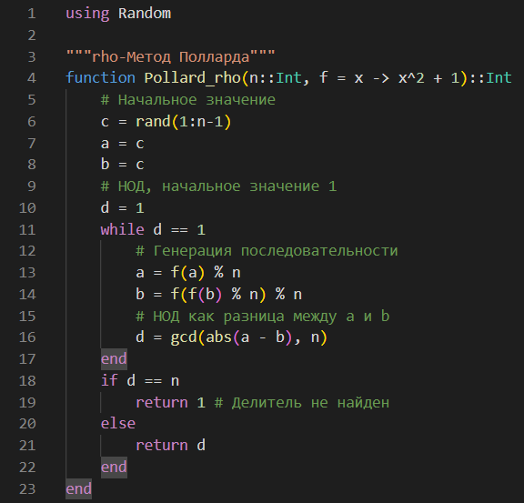
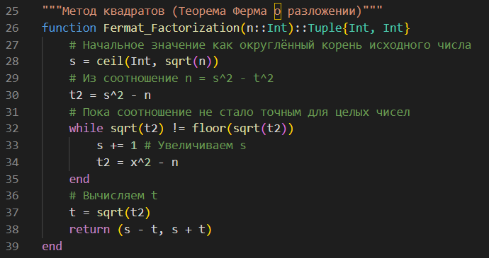
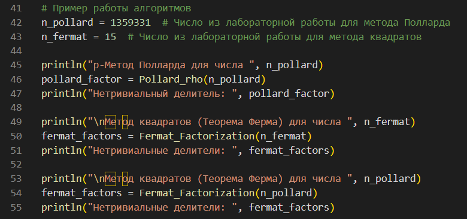
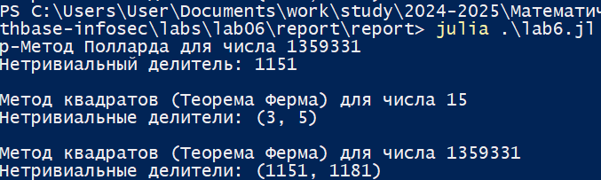

---
## Front matter
lang: ru-RU
title: Лабораторная работа №6
subtitle: Математические основы защиты информации и информационной безопасности
author:
  - Николаев Дмитрий Иванович, НПМмд-02-24
institute:
  - Российский университет дружбы народов имени Патриса Лумумбы, Москва, Россия
date: 8 ноября 2024

## i18n babel
babel-lang: russian
babel-otherlangs: english

## Formatting pdf
toc: false
toc-title: Содержание
slide_level: 2
aspectratio: 169
section-titles: true
theme: metropolis
header-includes:
 - \metroset{progressbar=frametitle,sectionpage=progressbar,numbering=fraction}
 - '\makeatletter'
 - '\beamer@ignorenonframefalse'
 - '\makeatother'
---

# Прагматика выполнения

- Освоение алгоритмов разложения чисел на множители — $\rho$-метода Полларда и метода квадратов (Теорема Ферма о разложении).

# Цели

Изучить работу алгоритмов разложения чисел на множители: $\rho$-Метод Полларда; Метод квадратов (Теорема Ферма о разложении); а также реализовать их программно.

# Задачи

1. Освоить и реализовать алгоритм $\rho$-метода Полларда на языке Julia;
2. Освоить и реализовать алгоритм метода квадратов (теорема Ферма о разложении) на языке Julia;
3. Разложить на множители некоторое заданное число.

# Выполнение работы

## Алгоритм $\rho$-метода Полларда

{#fig:001 width=70%}

## Алгоритм метода квадратов (теорема Ферма о разложении)

{#fig:002 width=70%}

## Начальные данные

{#fig:003 width=70%}

## Результат выполнения кода и сравнения алгоритмов

{#fig:004 width=70%}

# Результаты

По результатам работы, я изучил работу алгоритмов разложения чисел на множители: $\rho$-Метод Полларда; Метод квадратов (Теорема Ферма о разложении); а также реализовал их программно.
