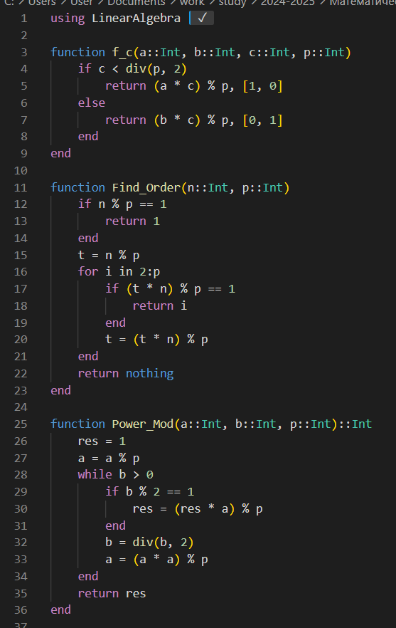
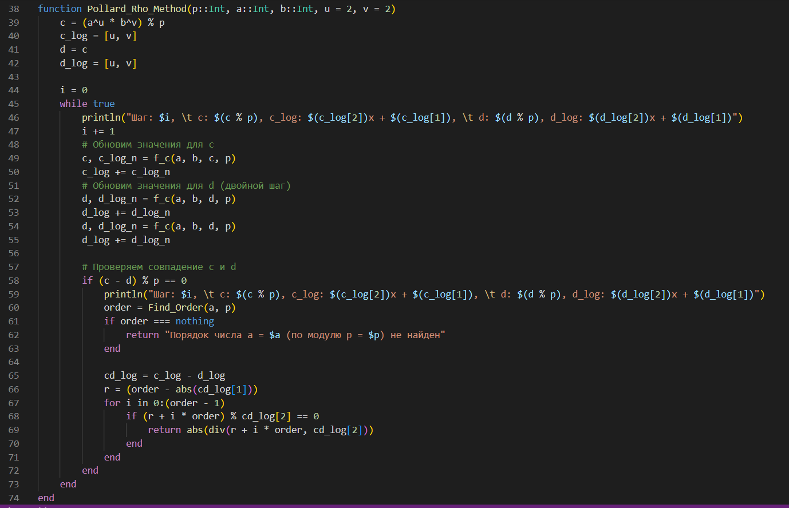

---
## Front matter
lang: ru-RU
title: Лабораторная работа №7
subtitle: Математические основы защиты информации и информационной безопасности
author:
  - Николаев Дмитрий Иванович, НПМмд-02-24
institute:
  - Российский университет дружбы народов имени Патриса Лумумбы, Москва, Россия
date: 4 декабря 2024

## i18n babel
babel-lang: russian
babel-otherlangs: english

## Formatting pdf
toc: false
toc-title: Содержание
slide_level: 2
aspectratio: 169
section-titles: true
theme: metropolis
header-includes:
 - \metroset{progressbar=frametitle,sectionpage=progressbar,numbering=fraction}
 - '\makeatletter'
 - '\beamer@ignorenonframefalse'
 - '\makeatother'
---

# Прагматика выполнения

- Освоение алгоритмов дискретного логарифмирования в конечном поле — $\rho$-метода Полларда для дискретного логарифмирования.

# Цели

Изучить работу алгоритмов дискретного логарифмирования в конечном поле — $\rho$-метод Полларда для дискретного логарифмирования, а также реализовать его программно.

# Задачи

1. Реализовать алгоритм программно для некоторых чисел $p, a, b$ и вычислить логарифм.

# Выполнение работы

## $\rho$-Метода Полларда (1/4)

{#fig:001 width=70%}

## $\rho$-Метода Полларда (2/4)

{#fig:002 width=70%}

## $\rho$-Метода Полларда (3/4)

{#fig:003 width=70%}

## $\rho$-Метода Полларда (4/4)

{#fig:004 width=70%}

# Результаты

По результатам работы, я изучил работу алгоритмов дискретного логарифмирования в конечном поле — $\rho$-метода Полларда для дискретного логарифмирования, а также реализовал его программно.
