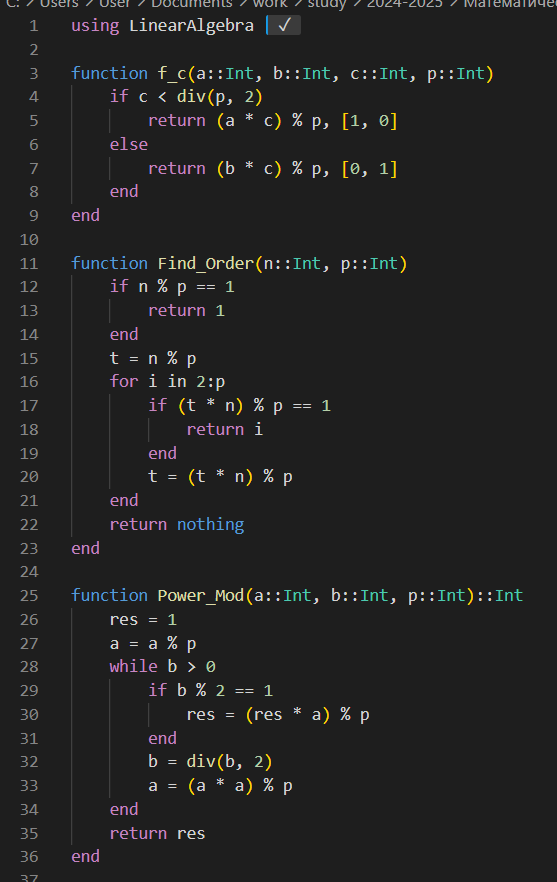
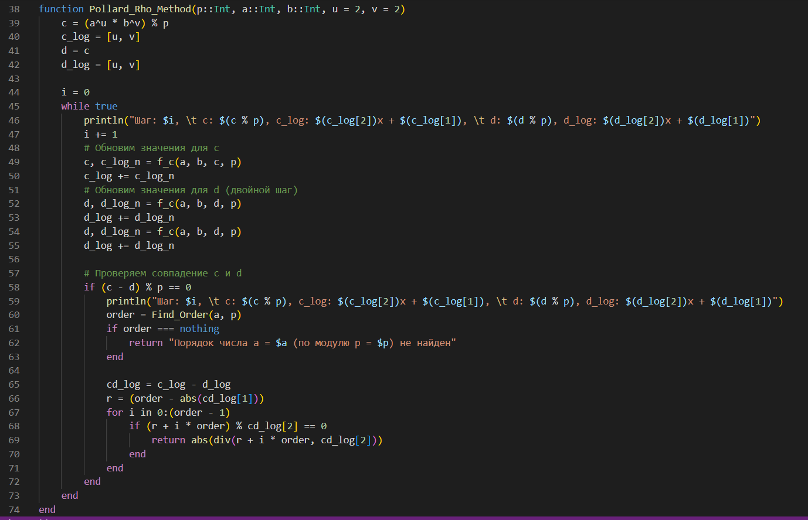
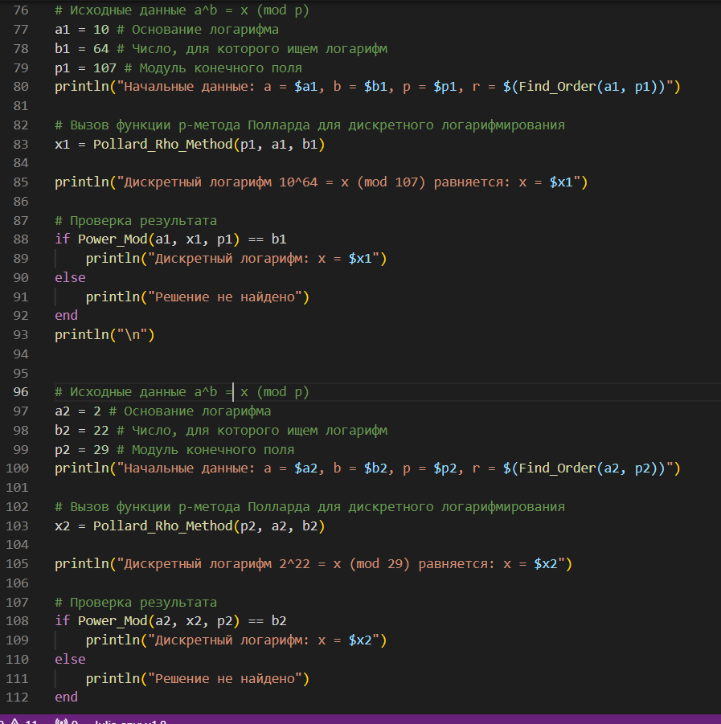
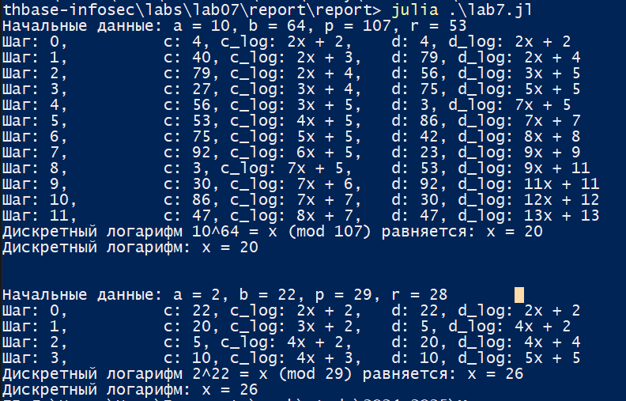

---
## Front matter
title: "Лабораторная работа №7"
subtitle: "Математические основы защиты информации и информационной безопасности"
author: "Николаев Дмитрий Иванович, НПМмд-02-24"

## Generic otions
lang: ru-RU
toc-title: "Содержание"

## Bibliography
bibliography: bib/cite.bib
csl: pandoc/csl/gost-r-7-0-5-2008-numeric.csl

## Pdf output format
toc: true # Table of contents
toc-depth: 2
lof: true # List of figures
lot: true # List of tables
fontsize: 12pt
linestretch: 1.5
papersize: a4
documentclass: scrreprt
## I18n polyglossia
polyglossia-lang:
  name: russian
  options:
	- spelling=modern
	- babelshorthands=true
polyglossia-otherlangs:
  name: english
## I18n babel
babel-lang: russian
babel-otherlangs: english
## Fonts
mainfont: PT Serif
romanfont: PT Serif
sansfont: PT Sans
monofont: PT Mono
mainfontoptions: Ligatures=TeX
romanfontoptions: Ligatures=TeX
sansfontoptions: Ligatures=TeX,Scale=MatchLowercase
monofontoptions: Scale=MatchLowercase,Scale=0.9
## Biblatex
biblatex: true
biblio-style: "gost-numeric"
biblatexoptions:
  - parentracker=true
  - backend=biber
  - hyperref=auto
  - language=auto
  - autolang=other*
  - citestyle=gost-numeric
## Pandoc-crossref LaTeX customization
figureTitle: "Рис."
tableTitle: "Таблица"
listingTitle: "Листинг"
lofTitle: "Список иллюстраций"
lotTitle: "Список таблиц"
lolTitle: "Листинги"
## Misc options
indent: true
header-includes:
  - \usepackage{indentfirst}
  - \usepackage{caption}
  - \usepackage{float} # keep figures where there are in the text
  - \floatplacement{figure}{H} # keep figures where there are in the text
---

# Цель работы

Изучить работу алгоритмов дискретного логарифмирования в конечном поле — $\rho$-метод Полларда для дискретного логарифмирования, а также реализовать его программно.

# Теоретическое введение

## Дискретное логарифмирование в конечном поле

Задача дискретного логарифмирования, как и задача разложения на множители, применяется во многих алгоритмах криптографии с открытым ключом. Предложенная в 1976 году У. Диффи и М. Хеллманом для установления сеансового ключа, эта задача послужила основой для создания протоколов шифрования и цифровой подписи, доказательств с нулевым разглашением и других криптографических протоколов.

Пусть над некоторым множеством $\Omega$ произвольной природы определены операции сложения «+» и умножения «$\cdot$». Множество $\Omega$ называется *кольцом*, если выполняются следующие условия:

1. Сложение коммутативно: $a + b = b + a$ для любых $a, b \in \Omega$;
2. Сложение ассоциативно: $(a + b) + c = a + (b + c)$ для любых $a, b, c \in \Omega$;
3. Существует нулевой элемент $0 \in \Omega$, такой, что $a + 0 = a$ для любого $a \in \Omega$;
4. Для каждого элемента $a \in \Omega$ существует противоположный элемент $-a \in \Omega$, такой, что $(-a) + a = 0$;
5. Умножение дистрибутивно относительно сложения:

$$
a \cdot (b + c) = a \cdot b + a \cdot c, \quad (a + b) \cdot c = a \cdot c + b \cdot c,
$$

для любых $a, b, c \in \Omega$.

Если в кольце $\Omega$ умножение коммутативно: $a \cdot b = b \cdot a$ для любых $a, b \in \Omega$, то кольцо называется *коммутативным*.

Если в кольце $\Omega$ умножение ассоциативно: $(a \cdot b) \cdot c = a \cdot (b \cdot c)$ для любых $a, b, c \in \Omega$, то кольцо называется *ассоциативным*.

Если в кольце $\Omega$ существует единичный элемент $e$ такой, что $a \cdot e = e \cdot a = a$ для любого $a \in \Omega$, то кольцо называется кольцом с единицей (или *унитарным*).

Если в ассоциативном, коммутативном кольце $\Omega$ с единицей (АКУ-кольце) для каждого ненулевого элемента $a$ существует обратный элемент $a^{-1} \in \Omega$, такой, что $a^{-1} \cdot a = a \cdot a^{-1} = e$, то кольцо называется *полем*.

Пусть $m \in \mathbb{N}$, $m > 1$. Целые числа $a$ и $b$ называются *сравнимыми по модулю $m$* (обозначается $a \equiv b \mod m$), если разность $a - b$ делится на $m$. Некоторые свойства отношения сравнимости:

1. *Рефлексивность*: $a \equiv a \mod m$.
2. *Симметричность*: если $a \equiv b \mod m$, то $b = a \mod m$.
3. *Транзитивность*: если $a \equiv b \mod m$ и $b = c \mod m$, то $a = c \mod m$.

Отношение, обладающее свойством рефлексивности, симметричности и транзитивности, называется отношением *эквивалентности*. Отношение сравнимости является отношением эквивалентности на множестве $\mathbb{Z}$ целых чисел.

Отношение эквивалентности разбивает множество, на котором оно определено, на *классы эквивалентности*. Любые два класса эквивалентности либо не пересекаются, либо совпадают.

Классы эквивалентности, определяемые отношением сравнимости, называются *классами вычетов по модулю $m$*. Класс вычетов, содержащий число $a$, обозначается $a \mod m$ или $\overline{a}$ и представляет собой множество чисел вида $a + km$, где $k \in \mathbb{Z}$; число $a$ называется представителем этого класса вычетов.

Множество классов вычетов по модулю $m$ обозначается $\mathbb{Z}/m\mathbb{Z}$, состоит ровно из $m$ элементов и относительно операций сложения и умножения является *кольцом классов вычетов* по модулю $m$.

Пример. Если $m = 2$, то $\mathbb{Z}/2\mathbb{Z} = \{0 \mod 2, 1 \mod 2\}$, где $0 \mod 2 = 2\mathbb{Z}$ - множество всех четных чисел, $1 \mod 2 = 2\mathbb{Z} + 1$ - множество всех нечетных чисел.

Обозначим $F_p = \mathbb{Z}/p\mathbb{Z}$, где $p$ - простое целое число, и назовем конечным полем из $p$ элементов. Задача дискретного логарифмирования в конечном поле $F_p$ формулируется так: для данных целых чисел $a$ и $b$, $a > 1$, $b < p$, найти логарифм - такое целое число $x$, что $a^x \equiv b \mod p$ (если такое число существует). По аналогии с вещественными числами используется обозначение $x = \log_a b$.

Безопасность соответствующих криптосистем основана на том, что, зная числа $a, x, p$, вычислить $a^x \mod p$ легко, а решить задачу дискретного логарифмирования трудно. Рассмотрим $\rho$-Метод Полларда, который можно применить и для задач дискретного логарифмирования. При этом случайное отображение $f$ должно обладать не только сжимающими свойствами, но и вычислимостью логарифма (логарифм числа $f(c)$ можно выразить через неизвестный логарифм $x$ и $\log_a f(c)$). Для дискретного логарифмирования в качестве случайного отображения $f$ чаще всего используются ветвящиеся отображения, например:

$$
f(c) =
\begin{cases}
ac, & \text{при } c < \frac{p}{2}, \\
bc, & \text{при } c \geq \frac{p}{2}.
\end{cases}
$$
При $c < \frac{p}{2}$ имеем $\log_a f(c) = \log_a c + 1$, а при $c \geq \frac{p}{2}$ имеем $\log_a f(c) = \log_a c + x$

## Алгоритм, реализующий $\rho$-Метод Полларда для задач дискретного логарифмирования

**Вход**. Простое число $p$, число $a$ порядка $r$ по модулю $p$, целое число $b$, $1 < b < p$; отображение $f$, обладающее сжимающими свойствами и сохраняющее вычислимость логарифма.

**Выход**. Показатель $x$, для которого $a^x = b \mod p$, если такой показатель существует.

1. Выбрать произвольные целые числа $u, v$ и положить $c \gets a^u b^v \mod p$, $d \gets c$.
2. Выполнять $c \gets f(c) \mod p$, $d \gets f(f(d)) \mod p$, вычисляя при этом логарифмы для $c$ и $d$ как линейные функции от $x$ по модулю $r$, до получения равенства $c \equiv d \mod p$.
3. Приравняв логарифмы для $c$ и $d$, вычислить логарифм $x$ решением сравнения по модулю $r$. Результат: $x$ или "Решений нет".

### Пример

Решим задачу дискретного логарифмирования $10^x = 64 \mod 107$, используя $\rho$-Метод Полларда. Порядок числа 10 по модулю 107 равен 53.

Выберем отображение $f(c) \equiv 10^c \mod 107$ при $c < 53$, $f(c) \equiv 64^c \mod 107$ при $c \geq 53$. Пусть $u = 2$, $v = 2$. Результаты вычислений запишем в таблицу:

\begin{table}[H]
    \centering
    \begin{tabular}{|c|c|c|c|c|}
        \hline
        Номер шага & $c$ & $\log_a c$ & $d$ & $\log_a d$ \\
        \hline
        0  & 4  & $2 + 2x$   & 4  & $2 + 2x$   \\
        1  & 40 & $3 + 2x$   & 76 & $4 + 2x$   \\
        2  & 79 & $4 + 2x$   & 56 & $5 + 3x$   \\
        3  & 27 & $4 + 3x$   & 75 & $5 + 5x$   \\
        4  & 56 & $5 + 3x$   & 3  & $5 + 7x$   \\
        5  & 53 & $5 + 4x$   & 86 & $7 + 7x$   \\
        6  & 75 & $5 + 5x$   & 42 & $8 + 8x$   \\
        7  & 92 & $5 + 6x$   & 23 & $9 + 9x$   \\
        8  & 3  & $5 + 7x$   & 53 & $11 + 9x$  \\
        9  & 30 & $6 + 7x$   & 92 & $11 + 11x$ \\
        10 & 86 & $7 + 7x$   & 30 & $12 + 12x$ \\
        11 & 47 & $7 + 8x$   & 47 & $13 + 13x$ \\
        \hline
    \end{tabular}
    \caption{Таблица шагов $\rho$-метода Полларда для дискретного логарифмирования}
\end{table}

Приравниваем логарифмы, полученные на 11-м шаге: $7 + 8x = 13 + 13x \mod 53$. Решая сравнение первой степени, получаем: $x = 20 \mod 53$.

Проверка: $10^{20} = 64 \mod 107$.

# Выполнение лабораторной работы

Действуя согласно [-@lab7], реализуем все описанные алгоритмы на языке Julia.

Реализуем функцию $\rho$-метода Полларда для нахождения нетривиального делителя составного числа (Рис.[@fig:001]) и метод квадратов (теорема Ферма о разложении) для разложения составного числа на 2 нетривиальных множителя (Рис.[@fig:002]). Найдём делители и разложим на множители числа 15 и 1359331 (Рис.[@fig:003]), в результате чего получим следующий вывод, представленный на Рис.[@fig:004].

{#fig:001 width=70%}

{#fig:002 width=70%}

{#fig:003 width=70%}

{#fig:004 width=70%}

# Выводы

В ходе выполнения лабораторной работы я изучил работу алгоритмов дискретного логарифмирования в конечном поле — $\rho$-метода Полларда для дискретного логарифмирования, а также реализовал его программно.

# Список литературы{.unnumbered}

::: {#refs}
:::
