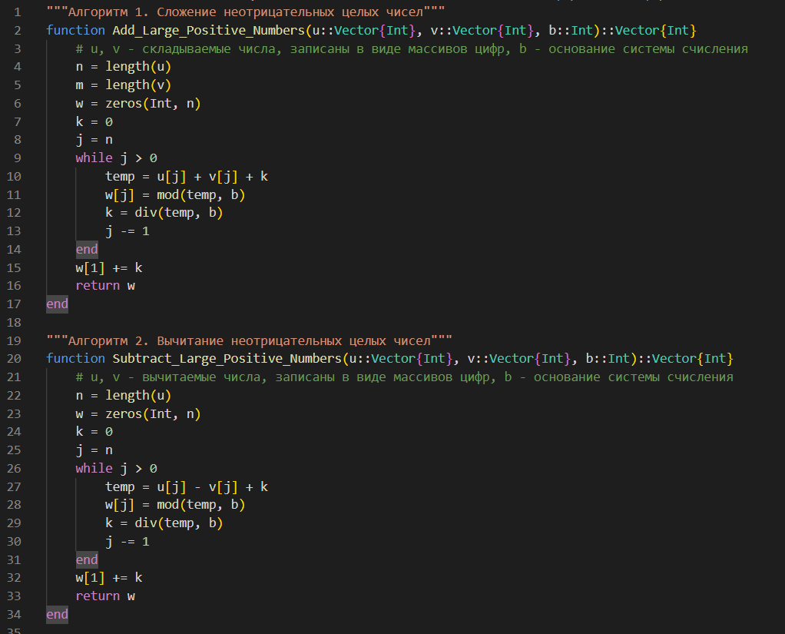
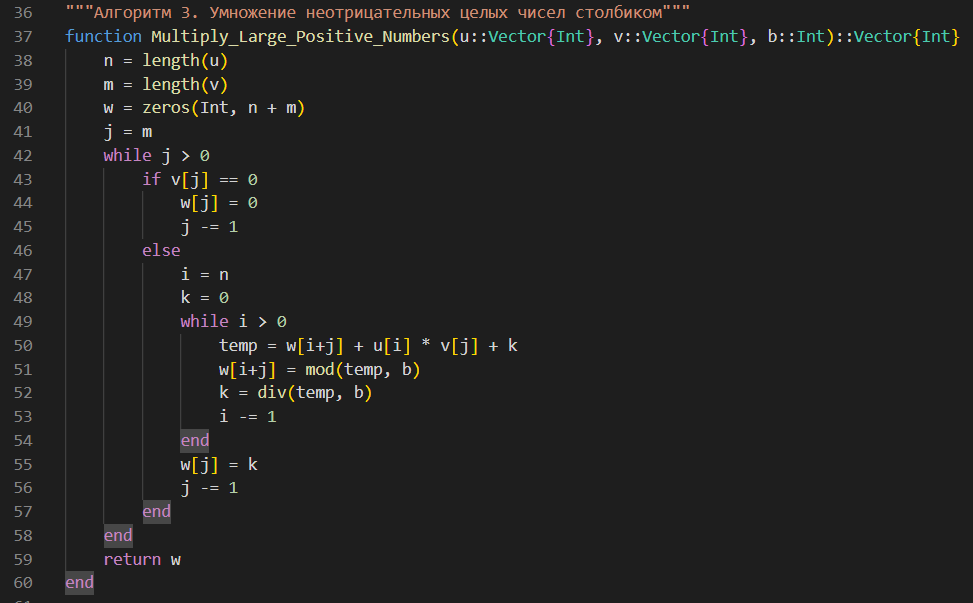
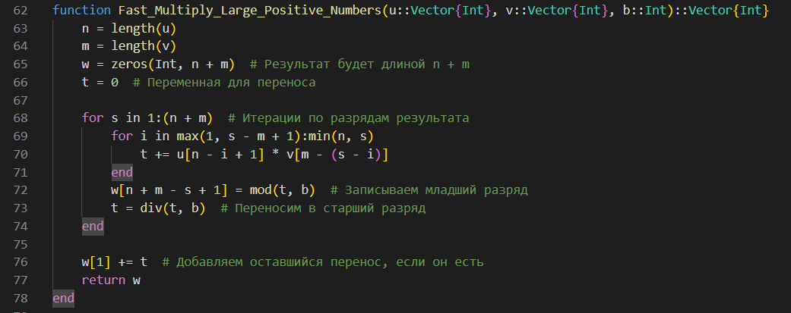
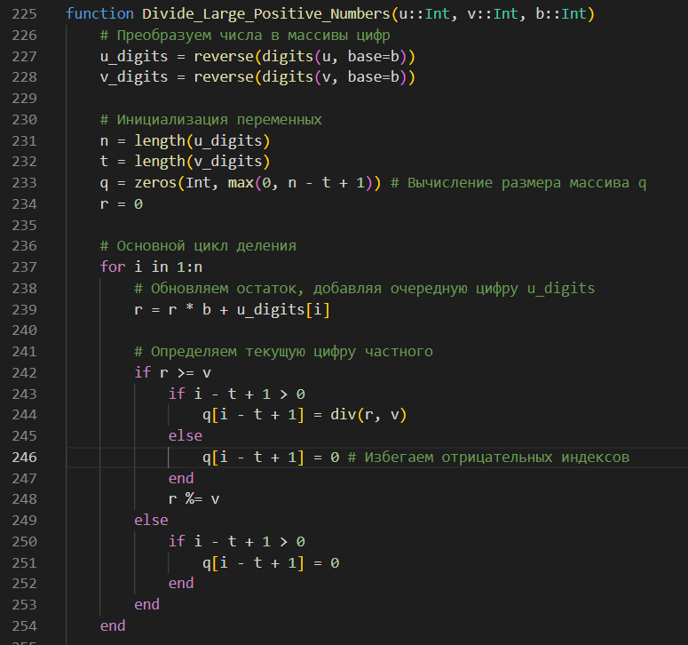
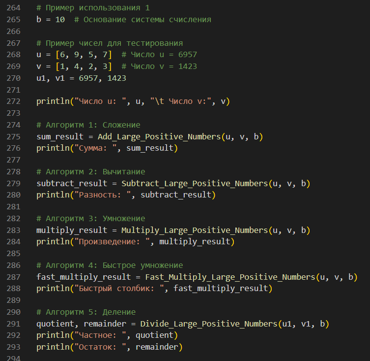
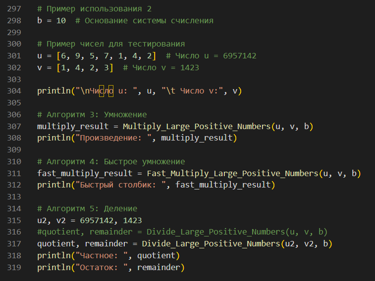
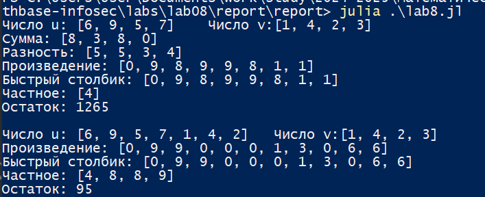

---
## Front matter
lang: ru-RU
title: Лабораторная работа №8
subtitle: Математические основы защиты информации и информационной безопасности
author:
  - Николаев Дмитрий Иванович, НПМмд-02-24
institute:
  - Российский университет дружбы народов имени Патриса Лумумбы, Москва, Россия
date: 21 декабря 2024

## i18n babel
babel-lang: russian
babel-otherlangs: english

## Formatting pdf
toc: false
toc-title: Содержание
slide_level: 2
aspectratio: 169
section-titles: true
theme: metropolis
header-includes:
 - \metroset{progressbar=frametitle,sectionpage=progressbar,numbering=fraction}
 - '\makeatletter'
 - '\beamer@ignorenonframefalse'
 - '\makeatother'
---

# Прагматика выполнения

- Освоение алгоритмов алгоритмов целочисленной арифметики многократной точности — сложение неотрицательных целых чисел, вычитание неотрицательных целых чисел, умножение неотрицательных целых чисел столбиком, быстрый столбик, деление многоразрядных целых чисел.

# Цели

Изучить работу алгоритмов целочисленной арифметики многократной точности: сложение неотрицательных целых чисел; вычитание неотрицательных целых чисел; умножение неотрицательных целых чисел столбиком; быстрый столбик; деление многоразрядных целых чисел; а также реализовать их программно.

# Задачи

1. Реализовать рассмотренные алгоритмы программно на языке Julia.

# Выполнение работы

## Алгоритмы сложения и вычитания многоразрядных неотрицательных целых чисел

{#fig:001 width=70%}

## Алгоритм умножения многоразрядных неотрицательных целых чисел столбиком

{#fig:002 width=70%}

## Умножение многоразрядных неотрицательных целых чисел алгоритмом быстрого столбика

{#fig:003 width=70%}

## Алгоритм деления многоразрядных неотрицательных целых чисел

{#fig:004 width=70%}

## Начальные данные (1/2)

{#fig:005 width=70%}

## Начальные данные (2/2)

{#fig:006 width=70%}

## Результат работы алгоритмов арифметических операций с многоразрядными целыми числами

{#fig:007 width=70%}

# Результаты

По результатам работы, я изучил работу алгоритмов целочисленной арифметики многократной точности: сложение неотрицательных целых чисел; вычитание неотрицательных целых чисел; умножение неотрицательных целых чисел столбиком; быстрый столбик; деление многоразрядных целых чисел; а также реализовал их программно.
